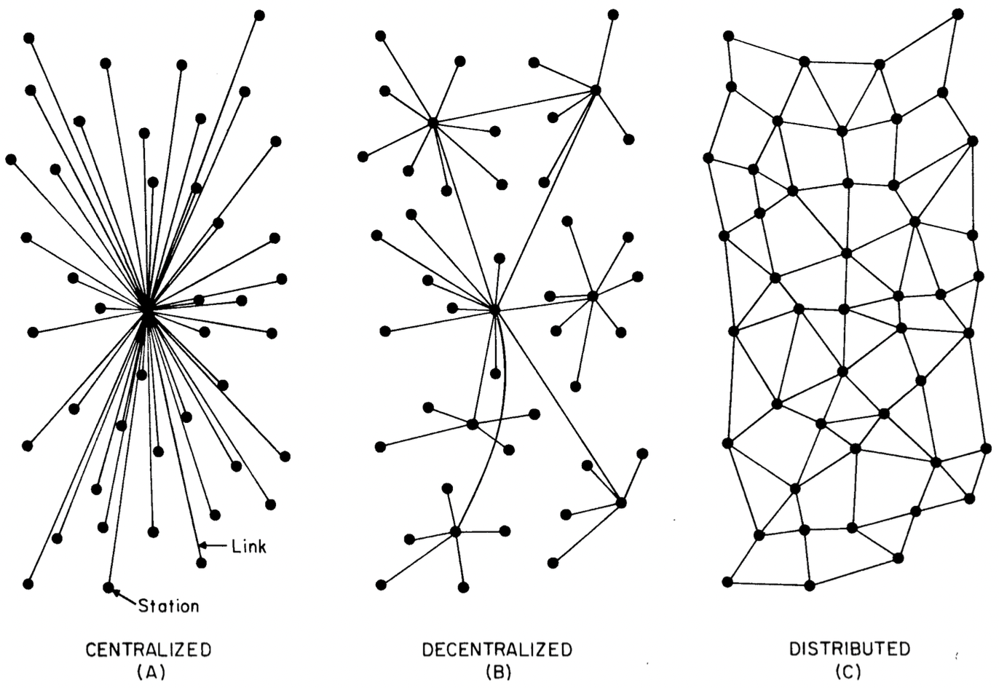

  
<figure>
  
  <figcaption align="center">Time to add JavaScript into the mix!</figcaption>
</figure>
  

# What is JavaScript, anyways?
Before we can get into this, let’s understand the shape of the web and how we got to where we are today.

## Let’s start with *the internet*

  <figure align="center">
  
  <figcaption><a href="https://en.wikipedia.org/wiki/Harvard_Computers#/media/File:Astronomer_Edward_Charles_Pickering%27s_Harvard_computers.jpg">The “Harvard Computers” in the late 1800s.</a></figcaption>
</figure>  

Before this time, the term *computer* usually referred to a person, not a machine—someone who would *compute* (solve) math problems.

It is worth noting these [were often women](https://www.nytimes.com/2019/02/13/magazine/women-coding-computer-programming.html), and they were underpaid compared to men in their field—and many would go on to operate the early mechanical/electronic computers. We’re going to have to talk about a lot of men, here—but know that women have been present from the start.

## The first computers

  <figure align="center">
  
  <figcaption>A diagram from Ada Lovelace’s first computer program.</figcaption>
</figure>  

Before the 1900s and the rise of the internet as we know it, [Charles Babbage](https://en.wikipedia.org/wiki/Charles_Babbage) invented the first mechanical computer, called the [Difference Engine](https://en.wikipedia.org/wiki/Difference_engine), in the 1820s. It’s purpose was to tabulate polynomial functions. While it was never completed, we often consider this to be the first example of a computer. Within this story, we also meet the first computer programmer, Ada Lovelace.

[Ada Lovelace](https://en.wikipedia.org/wiki/Ada_Lovelace) wrote a piece of software, or heuristic, for Babbage’s Difference Engine which calculated Bernoulli Numbers. Because it was the first published algorithm tailored specifically for a computer, Lovelace is often cited as a seminal figure in computer science history.

  <figure align="center">
  
  <figcaption>ENIAC, the first programmable, electronic, general-purpose digital computer completed in 1945.</figcaption>
</figure>  

By the 1960s, computers were room-sized, institutional electronic machines—used by governments (the military), businesses, and universities. They were used to solve complex math problems and sort data, but were still very slow and didn’t communicate with one another.

  <figure align="center">
  
  <figcaption>The original network, the telephone infrastructure, was heavily centralized via its switchboards and central hubs and therefore susceptible to catastrophic attack.</figcaption>
</figure>  

A catalyst in the formation of the internet was the Cold War. The threat of nuclear conflict spurred the US Defense Department to consider decentralized and distributed <nobr>networks—to</nobr> disseminate orders and information in the event of an attack (and ultimately, for retaliation).

> It was necessary to have a strategic system that could withstand a first attack and then be able to return the favor in kind. The problem was that we didn’t have a survivable communications system, and so Soviet missiles aimed at US missiles would take out the entire telephone-communication system [...] that was highly centralized. Well, then, let’s not make it centralized. Let’s spread it out so that we can have other paths to get around the damage.
> — [Paul Baran](https://www.vanityfair.com/news/2008/07/internet200807)
