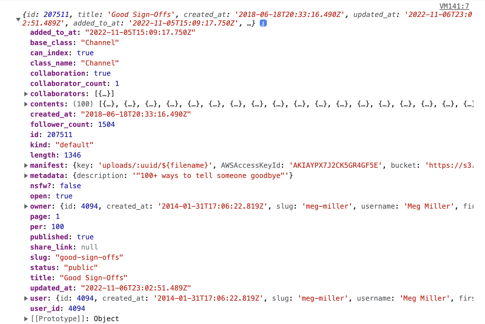

<br><br>
<figure align="center">
  
  <figcaption>IBM, Diagram of Dynamic Random-Access Memory Chip (DRAM), 1984. <a href="https://www.moma.org/collection/works/4288">↗</a></figcaption>
</figure>
<br><br>


# Data

Data is a collection of discrete values that convey information. The entire internet is founded on the flow of information and data. We’ve encountered data before, using Objects and Arrays to store values into data structures that our programs can manipulate.

At its core, data is stored in some abstraction that supports [CRUD](https://en.wikipedia.org/wiki/Create,_read,_update_and_delete) operations. CRUD stands for:

- **Create** a new piece of data
- **Read** an existing set of data
- **Update** an existing piece of data
- **Delete** an existing piece of data

Today, we’ll discuss how data can be managed and stored using JavaScript.

## Local Storage

[`localStorage`](https://developer.mozilla.org/en-US/docs/Web/API/Window/localStorage) allows us to persist data in the browser. It is associated with web addresses, and lets us keep track of data without having to use a database. 

`localStorage` encapsulates a [`Storage`](https://developer.mozilla.org/en-US/docs/Web/API/Storage) object. There is also [`sessionStorage`](https://developer.mozilla.org/en-US/docs/Web/API/Window/sessionStorage) which persists data until the session ends (however long a person spends on a website) and uses a very similar set of functions.

Local storage works very similar to how objects and maps work — they are key value paired. You store a JavaScript entity (object, array, string, boolean, etc.) under a string based key, and can access it by referencing that key. 

```js
// Create
localStorage.setItem('myCat', 'Tom');

// Read
const cat = localStorage.getItem('myCat');

// Update
localStorage.setItem('myCat', 'Neko');

// Delete
localStorage.removeItem('myCat');
```

Unlike cookies, which send data back and forth to a server, this approach contains data to just the user’s devices. This makes for approaches to creating web based applications without needing a traditional server to store data. Another benefit to this approach is there are no latency issues — so often developers will "cache" data into local storage that they receive from an API.

## APIs

An [Application Programming Interface](https://developer.mozilla.org/en-US/docs/Learn/JavaScript/Client-side_web_APIs/Introduction) (API) is a construct made available in programming languages to allow developers to create complex functionality more easily. 

APIs abstract more complex code away, providing some easier syntax to use in its place. An API has two parts: it has a specification and an implementation. The implementation is expected to follow the rules of the specification. 

We’ve already used APIs before, such as `document.querySelector()` or `Math.random()`. The W3C, a group of industry professionals, creates an API specification. Then, web browsers are expected to implement this specification. 

These days, APIs are used to communicate back and forth with external data sources. Web APIs exist as specific URLs that you construct to get the data you want. Here are two examples:

- [Weather](https://open-meteo.com/en/docs#api-documentation)
- [Are.na](https://dev.are.na/documentation)

These above are links to the documentation or specification of the API. They delinate instructions for using the API (sending queries), as well as how you should expect the data to be returned back to you.

For our purposes, we can expect all API response to be returned back to us in JavaScript Object Notation (JSON).

We’ve also used JSON before! To set the style of an element `myEl`, we do:

```js
myEl.style.backgroundColor = 'green';
myEl['style']['backgroundColor'] = 'green';
```

In this case, `myEl` is an object, `style` is a property of `myEl`, but is also an object, and `backgroundColor` is a property of `style`. We can reconstruct this abstraction in JSON as such:

```js
myEl = {
  'style': {
    'backgroundColor': 'green',
    'fontSize': '14px',
    'marginTop': '36px',
  }
};

```

## `fetch()`

To request data from another URL, we use the JavaScript [`fetch()`](https://developer.mozilla.org/en-US/docs/Web/API/Fetch_API/Using_Fetch) function. When `fetch()` is called, it returns an asynchronous [promise](https://developer.mozilla.org/en-US/docs/Web/JavaScript/Reference/Global_Objects/Promise) which will resolve when the data is returned back. Promises and asynchronous functions are out of the scope of this course.

```js
// A simple example of using fetch with arrow functions.
fetch('http://example.com/movies.json')
  .then((response) => response.json())
  .then((data) => console.log(data));
```

The most important thing to understand is that this is an example of function chaining. Function chaining allows you to have the response of a function feed directly as a parameter into another function and is a hallmark of functional programming.

## Fetching from Open-Meteo

To start, let’s see what it takes to request weather from an API and load it onto a webpage. Our HTML page will look something like this:

```html
<!-- index.html -->
<body>
  <h2 id="temp"></h2>
</body>

<script src="script.js"></script>
```

To start, let’s take a look at the [API documentation](https://open-meteo.com/en/docs#api-documentation) and some of their examples. We configure this and it will generate a custom API endpoint for us to use, for free. Here’s an example:

[https://api.open-meteo.com/v1/forecast?latitude=40.7143&longitude=-74.006&current_weather=true&temperature_unit=fahrenheit](https://api.open-meteo.com/v1/forecast?latitude=40.7143&longitude=-74.006&current_weather=true&temperature_unit=fahrenheit)

With many APIs you can actually see how a request is put together by looking at the URL. In this case, we use query parameters in key value pairs to denote:
- `latitude`: `40.7143`
- `longitude`: `74.006`
- `current_weather`: `true`
- `temperature_unit`: `fahrenheit`

> What do you think we need to adjust so our temperature is output in Celsius?

Looking at the API response, we’ll see a JSON formatted string which we can have JavaScript parse. I use the [JSONVue](https://chrome.google.com/webstore/detail/jsonvue/chklaanhfefbnpoihckbnefhakgolnmc) Chrome extension to format by API responses more cleanly — I recommend you install it or something similar.

<br><br>
<figure align="center">
  
  <figcaption>Response from Open Meteo.</figcaption>
</figure>
<br><br>

How would we access the current temperature from this response?

```js
// Assuming we store this object in the variable data:
data.current_weather.temperature;
```

Now let’s take a look at what our `fetch()` might look like in our `script.js` file:

```js
let url = `https://api.open-meteo.com/v1/forecast?latitude=40.7143&longitude=-74.006&current_weather=true&temperature_unit=fahrenheit`;

fetch(url)
  .then((response) => response.json())
  .then((data) => {
    // Print out all the data
    console.log(data);

    // Print out the current temperature
    console.log(data.current_weather.temperature);

    // Update the HTML element
    document.getElementById('temp').innerText = data.current_weather.temperature;
  });
```

> Now let’s spend some time exploring this API and aking our page look nicer in response to the API!


## Fetching from Are.na

Let’s take a look Meg Miler’s Are.na channel, [Good Sign-Offs](https://www.are.na/meg-miller/good-sign-offs). It has a unique channel slug `good-sign-offs`. We can look at Are.na’s [API](https://dev.are.na/documentation/channels#Block43472) and determine that if you visit the URL `https://api.are.na/v2/channels/[slug]`, you can get a JSON representation of the channel

<br><br>
<figure align="center">
  
  <figcaption>Response from Are.na for the below code.</figcaption>
</figure>
<br><br>

```js
let slug = 'good-sign-offs';
let url = `https://api.are.na/v2/channels/${slug}?per=100`;

fetch(url)
  .then((response) => response.json())
  .then((data) => {
    // Print out all the data
    console.log(data);

    // Print out the title property of the data
    console.log(data.title);

    // Gets the blocks
    let blocks = data.contents;
    blocks.forEach((block) => {
      // Prints out the content of the blocks
      console.log(block.content)
    })
  });

```