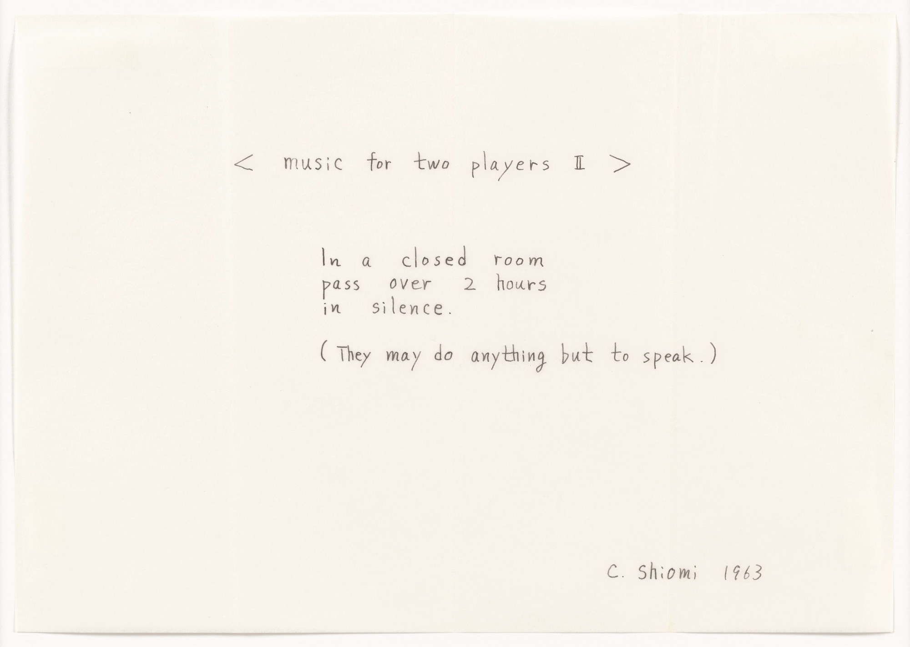
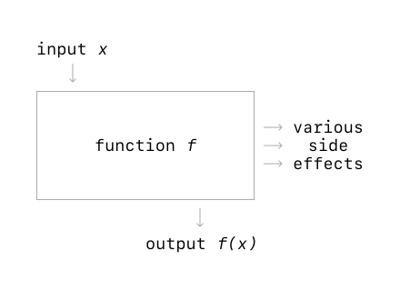
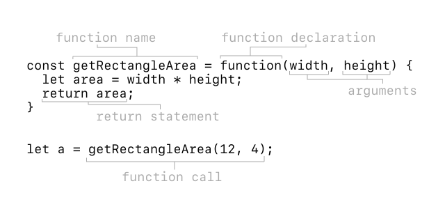
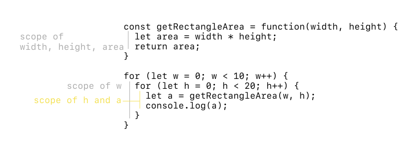

<br><br>
<figure align="center">
  
  <figcaption>Mieko Shiomi. <em>< music for two players II ></em>. 1963. <a href="https://www.moma.org/collection/works/127552?artist_id=5403&page=1&sov_referrer=artist">↗</a></figcaption>
</figure>
<br><br>


# Functions and Objects

What have we learned so far?
- Primitive data types and variable assignment
- Math
- Text based input/output (via console)
- Conditionals and Loops
- Arrays
  
Today we’ll focus on functions and objects. 

## Functions

> Functions are one of the fundamental building blocks in JavaScript. A function in JavaScript is similar to a procedure—a set of statements that performs a task or calculates a value, but for a procedure to qualify as a function, it should take some input and return an output where there is some obvious relationship between the input and the output. To use a function, you must define it somewhere in the scope from which you wish to call it.
>
> — [MDN](https://developer.mozilla.org/en-US/docs/Web/JavaScript/Guide/Functions)

Why do we write functions? Programmers are lazy. We want to write as little code as possible — therefore we adhere to a D.R.Y. (Don’t Repeat Yourself) principle. Later on, we’ll talk about how this can translate to HTML and CSS.

<br><br>
<figure align="center">
  
  <figcaption>Abstract diagram of a function. Think about how functions are used in math.</figcaption>
</figure>
<br><br>

Generally a function will perform a set of actions based on input and output the result. This isn’t always the case — a function can modify another value without returning anything — this is called a side effect.

We’ve already used functions before. In fact, all `Math.random()`, `Math.max()` are all functions that have made our life easier. In the assignments, you’ve actually written the body of functions.

### Anatomy of a function

<br><br>
<figure align="center">
  
  <figcaption>Anatomy of a function.</figcaption>
</figure>
<br><br>

To implement a function in JavaScript, you’ll need to:
- Create a *name* for the function
- Declare the function’s *arguments*
- Implement the function’s behavior in its *body*
- Specify if the function will *return* something to what calls it

A **library** is a set of functions. In JavaScript, libraries are packaged up like objects. We’ll talk about this more next lecture.

### Scope

The scope of a variable is the block of code which can access that variable. We talked about variable scoping briefly already, but scoping is important so as to limit variable pollution. Our rule of thumb should be that a variable should only exist within the scope that it is useful.

In JavaScript, a variable’s scope is the code following the variable’s declaration, in the same code block. This is the same for almost all programming languages.

<br><br>
<figure align="center">
  
  <figcaption>Scoping of variables.</figcaption>
</figure>
<br><br>

```js
  const cube = function(i) {
    return currentN * currentN * currentN;
  }

  let n = 5;
  for (let currentN = 0; currentN < n; currentN++) {
    console.log(cube(currentN));
  }
```

What is wrong with the above code?

### Some examples

```js
  const cube = function(i) {
    return i * i * i;
  }

  let n = 5;
  for (let currentN = 0; currentN < n; currentN++) {
    console.log(cube(currentN));
  }
```
**What will this do?** This will print out the cubes of numbers.

```js
  const cube = function(i) {
    i = i * i * i;
  }

  let n = 5;
  for (let currentN = 0; currentN < n; currentN++) {
    console.log(cube(currentN));
  }
```
**What will this do?** It will not print anything out, because we are not returning anything.


```js
  const cube = function(i) {
    let i = i * i * i;
    return i;
  }

  let n = 5;
  for (let currentN = 0; currentN < n; currentN++) {
    console.log(cube(currentN));
  }
```
**What will this do?** It will have an error because `i` has already been declared in the function argument.

```js
  const cube = function(i) {
    i = i * i * i;
    return i;
  }

  let n = 5;
  for (let currentN = 0; currentN < n; currentN++) {
    console.log(cube(currentN));
  }
```
**What will this do?** It will print out the cubes of numbers. But note how we are re-assigning `i`. This is valid, but considered bad style — we should never reassign the value of function arguments.

## Arrow functions

Another way we can declare functions is by using arrow function syntax. This was introduced in the ES6 version of JavaScript. The syntax is a bit simpler than how we have been declaring functions, but there are a few key differences between the two, most of which doesn’t really apply to us. 

```js
  // Our original function.
  const cube = function(i) {
    return i * i * i;
  }

  // The arrow (=>) stands in for the function keyword.
  const cube = (i) => {
    return i * i * i;
  }

  // Return is implied if there are no curly braces.
  const cube = (i) => i * i * i;
```

## Anonymous functions

JavaScript also supports anonymous functions. These are functions which have no name. Why would we want to do this? Well, sometimes we don’t plan to reuse the same function in multiple places. Instead, we want to define it and then immediately use it. 

Since variables that point to functions are pass by reference, any time we call a function or pass a variable to a function, we can also just use the function.

```js
// Anonymous function for cubing numbers, if we don’t use it again.
let n = 5;
for (let currentN = 0; currentN < n; currentN++) {
  console.log(function(i) {
    return i * i * i;
  }(currentN));
}

// Same function but using arrow syntax.
let n = 5;
for (let currentN = 0; currentN < n; currentN++) {
  console.log(((i) => {
    return i * i * i;
  })(currentN));
}
```

Frequently, we’ll use anonymous functions when iterating over arrays. All arrays have a built in method attached to them called `.forEach()`. Its [specification](https://developer.mozilla.org/en-US/docs/Web/JavaScript/Reference/Global_Objects/Array/forEach) says that it will take as an argument a callback function which can accept the element as an argument.

A **callback** is a function passesd to another function which wil get called by the outer function at some point. It "calls back" your function with a set of pre-agreed on parameters. Your function can choose to include them, or to just toss them. This is an example of a specification that we choose to adhere to.

```js
let boroughs = ['Manhattan', 'The Bronx', 'Brooklyn', 'Queens', 'Staten Island'];

//  Here is an anonymous function is called back by the forEach() function.
console.log('Boroughs of NY');
boroughs.forEach((borough) => {
  console.log(borough);
});

// This also works.
console.log('Boroughs of NY');
const printBorough = (borough) => {
  console.log(borough);
}
boroughs.forEach(printBorough);
```

---


## Objects

[Objects](https://developer.mozilla.org/en-US/docs/Web/JavaScript/Reference/Global_Objects/Object) are another common data structure in JavaScript. This is a key area where JavaScript differs from other programming languages. 

Objects are used to store various keyed collections and more complex values. 

With objects, data is stored in key-value pairs. You must know the key, which is a string, in order to access the value. Arrays are accessed using a numerical index.

Why do we call this data type an object? Well, it is meant to represent an entity. In fact, we’ll spend an entire lecture later talking about Object Oriented Programming. 

For now, here’s an example syntax:

```js
  let apple = {
    color: 'green',
    weight: 25,
    'isRotten': false
  }; // Defines a variable apple with object literal syntax. It contains three keys and values. Note the usage of commas to separate these key values.

  apple['color']; // Access an object with key 'color', 'green'.
  apple.color; // Similar as above, but less flexible. You can use either.

  apple.isRotten = true; // Updates the value of apple.isRotten.
```

Like arrays, objects are also pass by reference. If you want to create a copy of an object, you’ll have to write more specialized logic. We can’t just iterate over an object like we would an array. More on this later. 

Objects can store primitives, functions, arrays, and even other objects. Let’s take a look at this example below:

```js
  let apiResponse = {
    ok: true,
    statusCode: '200',
    response: {
      title: 'JS Lecture',
      content: 'Don’t you already know everything about JS?',
      comments: [
        'Too short!',
        'Yes obviously',
        'I think I might have missed something'
      ]
    }
  }
```

This is an example of using JS object notation to return an API response. In fact, this method of representing object literals in JavaScript is so popular that it is called JSON for JavaScript Object Notation.

How would we access the first element of the API response?

```js
apiResponse['response']['comments'][0];

// These two are equivalent

let response = apiResponse['response'];
let comments = response['comments'];
comments[0] 
```