<br><br>
<figure align="center">
  
  <figcaption><a href="https://www.devguide.at/en/git/pull-push-the-remote-repository/">A visualization of the way we use git</a></figcaption>
</figure>
<br><br>

## What is Git?

Git is a open source free software, created by [Linus Torvalds](https://en.wikipedia.org/wiki/Linus_Torvalds) (also the inventor of Linux). It allows for for us to create versions of our code as we work on it. It *also* allows us to store our code on both our computers and in the cloud, on a remote server.

GitHub is a platform that makes it easy to host git repositories remotely to access them. This makes it incredibly easy for anyone to access code and to collaborate on software. For example, you can access the codebase for this website, [here](https://github.com/f22-psam3210/.github). In fact, you can even make a copy of it directly to your computer!

To do this, you can either use [GitHub Desktop](https://desktop.github.com/), or my preferred way, the command line. Note that if you have a Windows device, you may have to [install git](https://git-scm.com/download/win).

Make sure you have a GitHub account before this next step, and sign up with your New School email so you can also get some student benefits!

## Let’s make a repo!

In this brief tutorial, we’ll go over creating a repository, and committing some code to it. We’ll also go over making it accessible using GitHub Pages, the platform’s free web hosting service.

<br><br>
<figure align="center">
  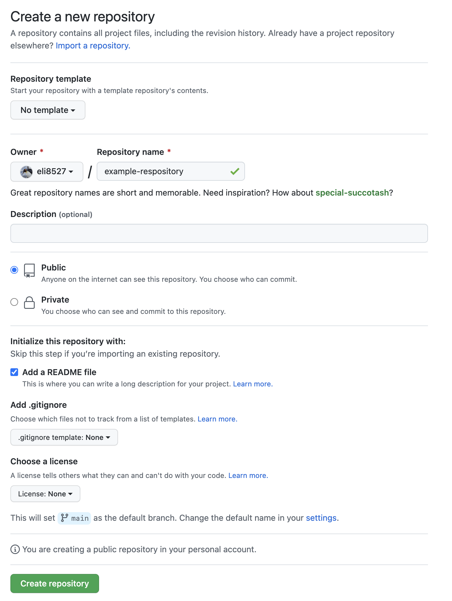
  <figcaption>Making a new repo in GitHub</figcaption>
</figure>
<br><br>

Navigate [here](https://github.com/new). You can also click the `+` button in the top right part of the navigation to create a new repository.

> A repository is a central location for your code to live in. It stores the current state of the code, as well as any previous versions you may want to keep

On this page, set the repository name to something creative or unimaginative, like `example-repository`. Also check `Add a README file`. This will create the repository with a `README` that details the information about the repository. Click **Create Repository**.

<br><br>
<figure align="center">
  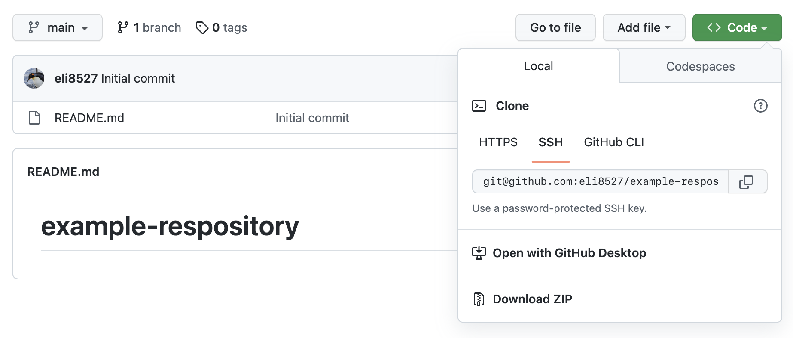
  <figcaption>Click <strong>Open with GitHub Desktop</strong></figcaption>
</figure>
<br><br>

On your computer, make a folder called `dev` in your home folder. This is where we’ll place all the code for this course.

<br><br>
<figure align="center">
  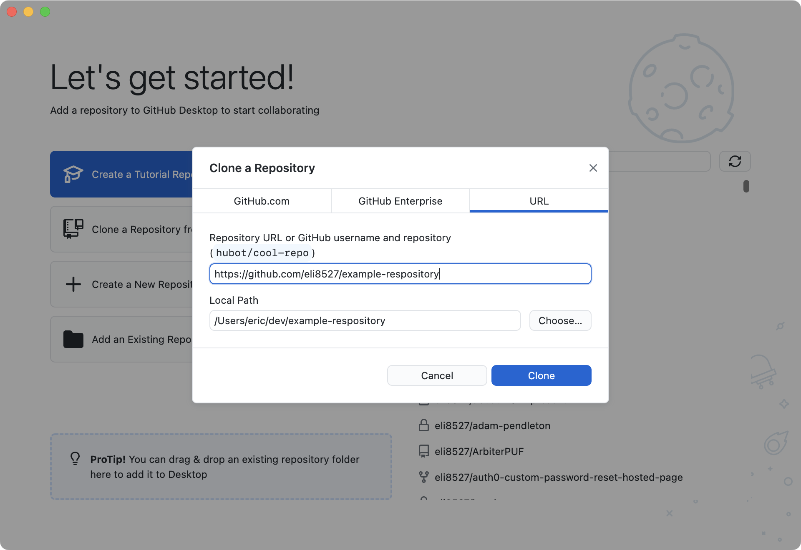
  <figcaption>Adjust the location of your repository if necessary.</figcaption>
</figure>
<br><br>

<br><br>
<figure align="center">
  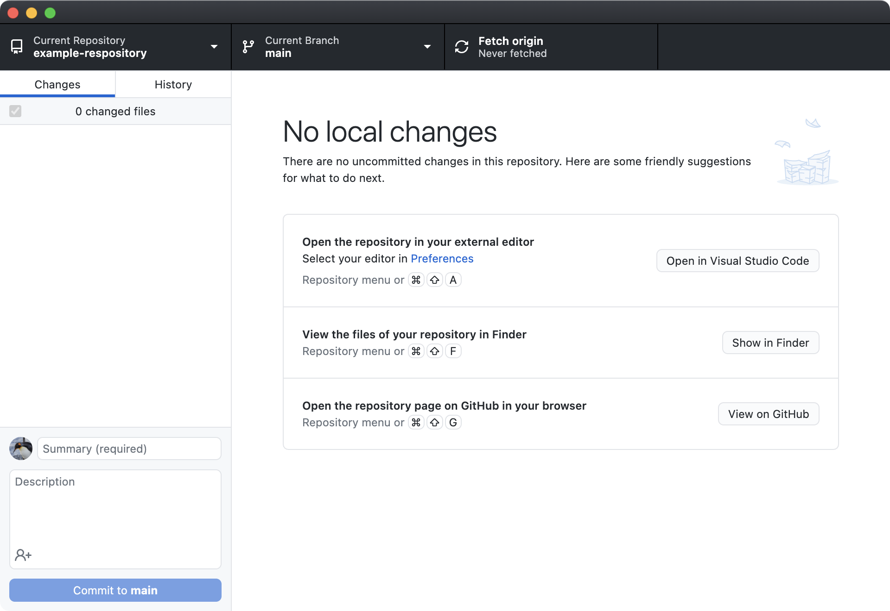
  <figcaption>Your GitHub Desktop should look like this.</figcaption>
</figure>
<br><br>

At this point you’ve now cloned a copy of online repository to your computer. This means you can save versions of your code locally, and then when ready, push all these changes and sync up with the remote repository.

The only file in it is the `README.md` that was created when we made the repository. Let’s go ahead and add some code here and then save it, add it to our local repository, and then push it online.

Why don’t we go ahead now and click **Open in Visual Studio Code**. This will open the project in a text editor.

<br><br>
<figure align="center">
  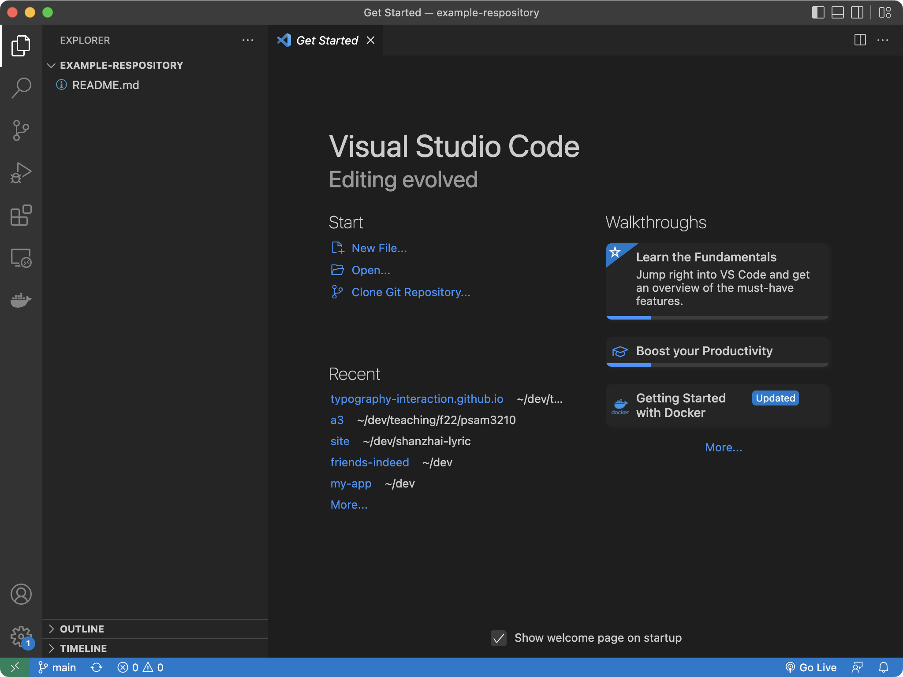
  <figcaption>Our repository in VS Code. It’s a bit empty.</figcaption>
</figure>
<br><br>

Now, let’s make a new file by typing `⌘-N`. We can save it as `index.html`. Once we’ve done that, paste the following snippet in.

```html
<!DOCTYPE html>
<html lang="en">
<head>
  <meta charset="UTF-8">
  <meta http-equiv="X-UA-Compatible" content="IE=edge">
  <meta name="viewport" content="width=device-width, initial-scale=1.0">
  <title>Hello, Git!</title>
</head>
<body>
  <h1>Hi, it’s Git!</h1>
  <script>
    console.log('Hello, World!');
  </script>
</body>
</html>
```

I would strongly recommend installing an extension for VSCode called [Live Server](https://marketplace.visualstudio.com/items?itemName=ritwickdey.LiveServer) as it’ll make further development easier. Once you’ve installed it, you can click in the bottom `Go Live`. This will launch a development web server in your computer.

When you’re done, just go back and stop it by clicking on the port.

<br><br>
<figure align="center">
  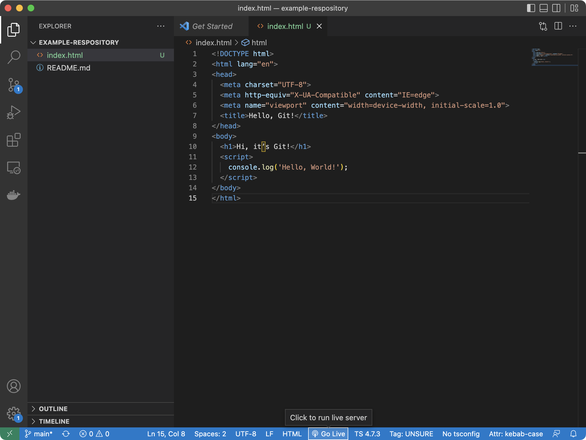
  <figcaption>Our repository in VS Code. With some code in it.</figcaption>
</figure>
<br><br>

Switching back to GitHub Desktop, we can see that now it has registered a change. Since we’re done editing our code for now, why don’t we write a Summary, like `Added an index.html` and then click `Commit to main` when we feel good about our changes.

<br><br>
<figure align="center">
  
  <figcaption>Our code changes, with a commit message.</figcaption>
</figure>
<br><br>

We’ve now committed our changes to our local repository of code, and are ready to push these to GitHub! Click the `Push origin` button in the top right corner of the interface, and off we go!

<br><br>
<figure align="center">
  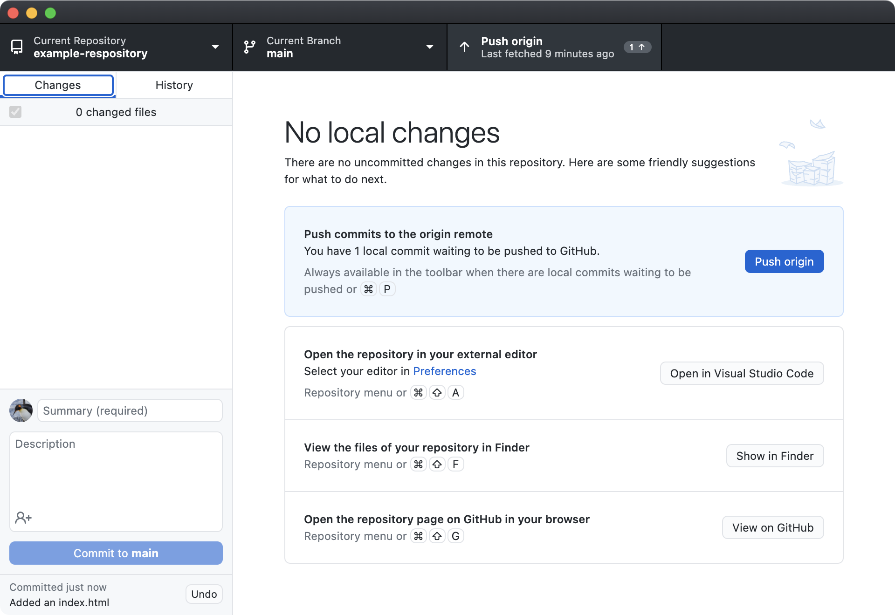
  <figcaption>Right before we push our changes to the origin (GitHub).</figcaption>
</figure>
<br><br>

Once we’ve clicked `Push origin`, you’ll notice that the button then changes to `Fetch origin`. This will fetch any changes that were pushed up to GitHub by someone else or if we edited the code directly in GitHub. Very useful!

Checking back at GitHub in our browser, we can now see the new file is there!

<br><br>
<figure align="center">
  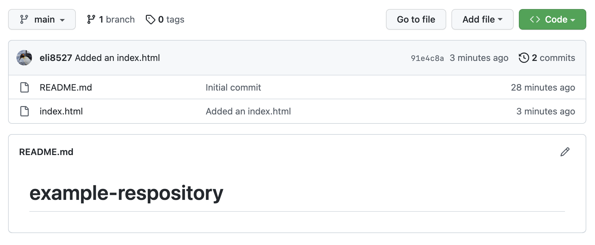
  <figcaption>Woohoo! A copy of our file now lives online.</figcaption>
</figure>
<br><br>

We’ll use this paradigm as we develop. It’s a good habit to commit any good stopping points in your code and that these commits are working. That way, if you mess up, you’re able to go back to an earlier version of your code. You’ll also upload to GitHub to share your work with me.

## GitHub Pages

<br><br>
<figure align="center">
  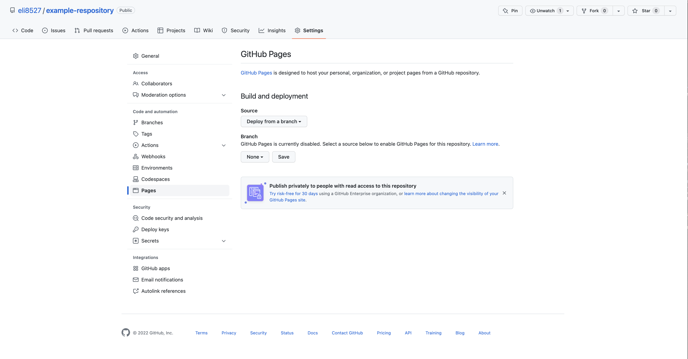
  <figcaption>Let’s navigate to the pages part of our repository.</figcaption>
</figure>
<br><br>

Let’s say we want this to live online as a website. Well, GitHub allows for hosting of relatively straight forward websites! To do this, let’s navigate back to our repository online. We can click on the `Settings` tab, followed by `Pages` in the left navigation of the `Settings` tab.

<br><br>
<figure align="center">
  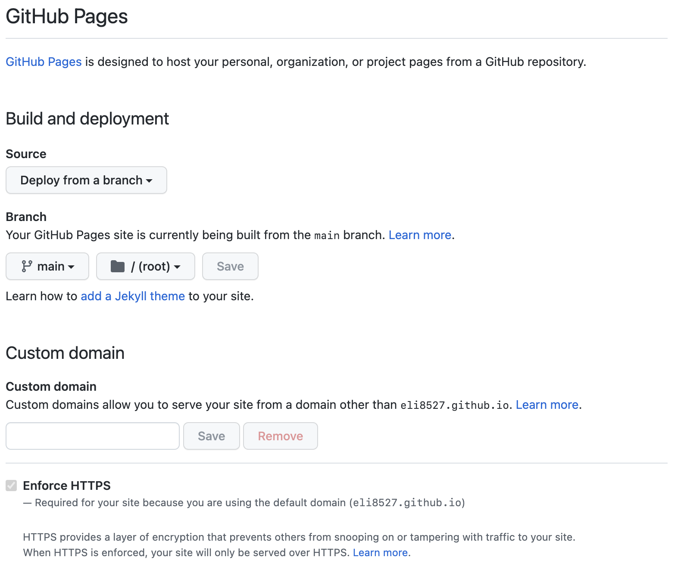
  <figcaption>Setting up GitHub Pages.</figcaption>
</figure>
<br><br>

Here we’ll want to set the `Source` as `Deploy from a branch` and set the `Branch` to `main` and then click `Save`.

This will kick off a script behind the scenes that will get the code from our repository and put it at a URL. You can see this in action if you click on the `Actions` tab.

<br><br>
<figure align="center">
  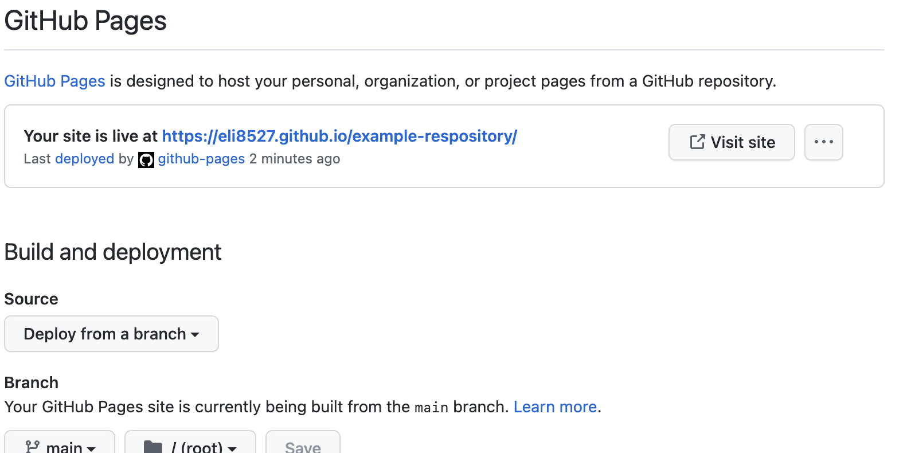
  <figcaption>Our page is live!</figcaption>
</figure>
<br><br>

After a few minutes, we’ll refresh the `Pages` page and if it all goes well, we should now see a link to a live version of our site that we can then share with others. Now any time I push code to my repository, GitHub pages will automatically rebuild the website. Pretty neat.


<br><br>
<figure align="center">
  
  <figcaption>Fin.</figcaption>
</figure>
<br><br>

## Forking

<br><br>
<figure align="center">
  
  <figcaption>Not this one…</figcaption>
</figure>
<br><br>

[Forking](https://en.wikipedia.org/wiki/Fork_(software_development)) is another term that is derived from our tree metaphor that git relies on. It is a practice that’s commonly used in open source software (OSS) which allows contributors:

1. “Fork” a copy of the code into their own separate repository
2. Make modifications to the code and preview those changes
3. Create a “Pull Request” back to the original code


> Fork the [class repository](https://github.com/psam3210/.github) and edit your entry in <code>people.md</code>. Include your preferred name, pronouns, and a brief introduction (such as your favorite HTML element).