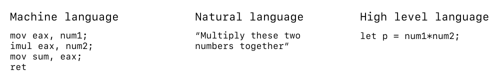
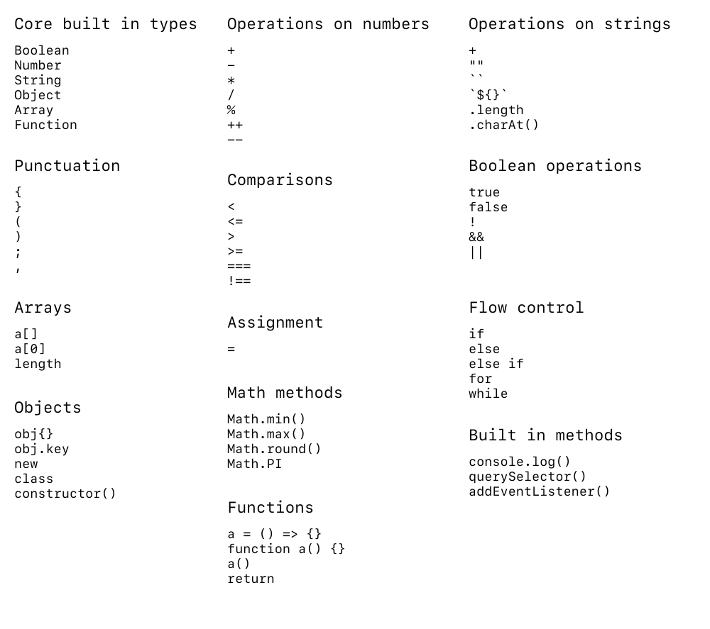
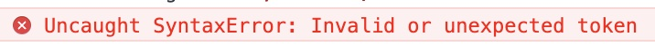
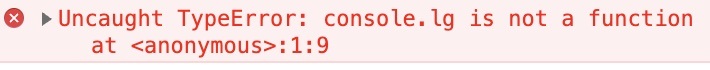
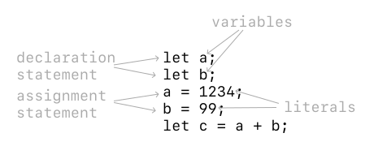

<br><br>
<figure align="center">
  
  <figcaption>The first computer bug — a moth — found by Grace Hopper on the Mark II Computer at Harvard in 1947.</figcaption>
</figure>
<br><br>


# JavaScript Basics

JavaScript was invented in 1995 by an engineer at Netscape, Brendan Eich. At the time, the web was purely static (built on HTML and CSS) and so the desire for more dynamic led to the creation of a web-based scripting language. Originally called LiveScript, Eich renamed the language to JavaScript to capitalize on the popularity of the programming language Java. 

While Java and JavaScript would see to have a lot in common, their similarities stop with their naming. 

Since its inception, JavaScript has been constantly tinkered with and standardized. The language has slowly evolved since its creation in 1995:
- ECMAScript 1, June 1997
- ECMAScript 2, June 1998
- ECMAScript 3, December 1999
- ECMAScript 4, never released due to competing approaches
- ECMAScript 5, December 2009
- ECMAScript 6, June 2015

ECMAScript 6 marked the last major shift in the language specification, and new versions with minior tweaks have since come out yearly. We will be learning JavaScript in its most recent syntax, and many of these core concepts have and will stay the same.

## What is a programming language?

At its core, a programming language tells a computer what to do, exactly how you want to do it. In order to understand what we can do with programming:
- We need to learn what computers can and can’t do
- We need to learn a programming language: JavaScript

As I’ve said before, a computer is nothing more than a fancy calculator which can do things millions of times a second. In order to tell it what to do, what are our options?

<br><br>
<figure align="center">
  
  <figcaption>Machine language, natural language, high-level language are all potential candidates</figcaption>
</figure>
<br><br>

**Machine language** is great for telling the computer *exactly* what we want it to do. But as you can see, it’s very tedious and super easy for humans to make mistakes. 

A **natural language** like English may seem ideal, until we realize that it’s hard to be specific enough for a machine to correctly interpet. In the above statement, the machine has no idea which numbers we’re referring to, or where to put the product.

**High-level languages** are a good compromise. It is a bit harder to read than natural language, but significantly easier than machine language. And it has enough specificity for a computer as well!

## Our choice: JavaScript

A programming language generally has the same features and primitives, regardless of its syntax. Languages may be created with certain goals in mind, but at the end of the day, they share the same building blocks. Your programs will use the JavaScript syntax and likely consist of this vocabulary:

<br><br>
<figure align="center">
  
  <figcaption>Some JS vocabulary.</figcaption>
</figure>
<br><br>

## Our first program

As [is tradition](https://en.wikipedia.org/wiki/%22Hello,_World!%22_program), our first program will be to write out Hello World to the console. 

> The console is a built in text output area in JavaScript that makes it easy for us to debug our programs. We can print whatever we want to it, at any point by calling `console.log()`. You can view it in Chrome by right clicking on a page, and clicking 

```js
console.log('Hello, World!');
```

Our first program! JavaScript has a built in [console object](https://developer.mozilla.org/en-US/docs/Web/API/console) called `console`. This object has certain functions attached to it which we can call. In this case, we are calling its `log()` function, and passing the string `'Hello, World!'` as an argument. 

> Functions are a set of code statements which perform a task and can be called ad nauseum. It can take an input (arguments) and return an output. You must define the function first before you call it, or it should have already been defined by the standard library.

### Including JavaScript in the browser

We should also discuss ways to include JavaScript in your browser itself. There are primarily two ways to do this. 

The first is in a `.html` file using the `<script>` tag:

```html
<!-- index.html -->
<!DOCTYPE html>
<html lang="en">
<body>
  <script>
    console.log('Hello, World!');
  </script>
</body>
</html>
```

The second is to include it as a separate `.js` file:

```html
<!-- index.html -->
<!DOCTYPE html>
<html lang="en">
<body>
  <script src="main.js"></script>
</body>
</html>
```

```js
// main.js
console.log('Hello, World!');
```

I generally suggest keeping your JS, HTML, and CSS separate as that keeps your codebase clean and uncluttered! 

The order in which you call your scripts also matters! When a browser loads a webpage, it starts from the top and works its way down. Therefore, these two examples will produce different output. 

Can you guess what will happen?

```html
<!-- index.html -->
<!DOCTYPE html>
<html lang="en">
<body>
  <script src="main.js"></script>
  <script>
    console.log('Goodbye, world!');
  </script>
</body>
</html>
```

```html
<!-- index.html -->
<!DOCTYPE html>
<html lang="en">
<body>
  <script>
    console.log('Goodbye, world!');
  </script>
  <script src="main.js"></script>
</body>
</html>
```

### Debugging your code

At some point, you’ll probably see an error message in your console. If you find that your code isn’t running or working the way you expect to, accessing the console is the first thing that you should do.

Let’s say we run this snippet of code and get the following error:

```js
console.log('I am a program!);
```

<br><br>
<figure align="center">
  
  <figcaption>You’ll probably run into this often. A syntax error means your code is missing a closing bracket, quote, or otherwise cannot be parsed by the browser.</figcaption>
</figure>
<br><br>

What do you think happened? How do we fix this?

Here’s one more:

```js
console.lg('I am a program!');
```

<br><br>
<figure align="center">
  
  <figcaption>A type error. It happens when you try to call something that doesn’t exist.</figcaption>
</figure>
<br><br>

## Programming Style

JavaScript and many other programming languages don’t really care about extra spaces, indentation, or comments. These two programs are exactly the same:

```js
// Program 1
let a = 10;
let b = 20;
let prod = a * b;
console.log(prod);

// Program 2
let a = 10; let b = 20; let prod = a*b; console.log(prod);
```

However, we as humans, need structured and legible code for us to be able to read and write properly! Consistent style makes it easier to spot errors, allow others to read and use code, and allow syntax highlighting from our code editor.

Throughout this class (and beyond), you should stick to a consistent code writing style based on examples from class and feedback from assignments. In later assignments, points may be deducted for abhorrent violations of style. 

We’ll refer back to [Airbnb’s JavaScript style guide](https://github.com/airbnb/javascript) as the gold standard for code style.

## Software development lifecycle

As you write code, you’ll likely fall into the following cyclical process (if you don’t already):

1. **Write** your code in VSCode or another text editor
2. **Run** your program in Google Chrome or another web browser
3. **Debug** your code via the console or other visual cues

---

## Built in data types

JavaScript has several built in data types. A data type is a set of values and a set of operations on those values. You’ll use these a lot throughout your programming life, and most programming languages share the same data types. 

### Some definitions
* A **variable** is a name that refers to a value
* A **literal** is a programming-language representation of a value
* A **declaration statement** initializes a variable
* An **assignment statement** associates a value with a variable

<br><br>
<figure align="center">
  
  <figcaption>Some definitions.</figcaption>
</figure>
<br><br>

### Storing data types

All data types and objects in JavaScript are stored in variables. Variables are pieces of information which we can store for later use. They don’t care what they contain, but allow us to reference back to it. 

A variable can be defined as `let` or `const` depending on if we plan to change its value later on. We can later reassign its value without defining it again. We name variables in JavaScript using the [camelCase](https://en.wikipedia.org/wiki/Camel_case) naming convention, where the there are no spaces and the first letter is lowercased. For example, `My Variable` becomes `myVariable`.

```js
let myVariable = 10; // myVariable is 10
myVariable = 20; // myVariable is 10

let myVariable = 15; // This will give us an error because we’ve already defined this variable.


const myConst = 'eric'; // myConst is 'eric'
myConst = 'li'; // This will give us an error because we’ve said this variable is a constant.


var myVar = 10; // We don't ever use this anymore because of scoping issues.
```

### Strings

A [`String`](https://developer.mozilla.org/en-US/docs/Web/JavaScript/Reference/Global_Objects/String) will store pieces of text, or a string of characters. There are several ways to denote a string, but the most common way is by using single quotes around the text: 

`'i am a string'`

Strings are used commonly for input and output. You’ll probably use or create one to set CSS properties, debug code, or update HTML.

You can combine (concatenate) strings using `+`:

```js
'i am' + 'a string' // Becomes 'i ama string'
'i am' + ' a string' // Becomes 'i am a string'

'i am' + ' + ' + 'a string' // What does this become?
```

You can also use `+=`:

```js
let str = 'i am'; // 'i am'
str += ' a string' // 'i am a string'
```

Another thing we can do with strings is interpolate them. This is the practice of evaluating a string with placeholders within it, replacing the value of the placeholder variable:

```js
let name = 'Eric'; // 'Eric'
let greeting = `Hello, ${name}!`; 'Hello, Eric!'
```

### Numbers

A [`Number`](https://developer.mozilla.org/en-US/docs/Web/JavaScript/Reference/Global_Objects/Number) in JavaScript stores, well, anything numerical. You can use any standard arithmetic on numbers, such as `+`, `-`, `/`, `*`, and `%`. The last symbol may be new to you — it is a modulo operator and will evaluate the remainder of a number divided by another. We can also wrap more complicated math in parentheses to ensure a specific order of operations.

> While JavaScript allows a `Number` to hold both an integer (whole number) and a floating point number (number with decimals), most programming languages represent these as different data types. This is because of the different memory requirements necessary — you need many more bits to represent a floating point number than an integer.

```js
1 + 1 // 2
2 * 2 // 4
9 / 6 // 1.5
9 % 6 // 3

2 + 3 / 5 // 2.6
(2 + 3) / 5 // 1

5 / 0 // What do we think this is?
```

Sometimes we might want to turn a string into a number. This might happen when we read the value of an input in JavaScript, but know it is numeric. To do this, we can use the `parseInt()` or `parseFloat()` functions that JavaScript has.

```js
parseInt('24') // 24
parseInt('24.5') // 24
parseInt('24.5px') // 24

parseFloat('24.5') // 24.5
parseFloat('24.5px') // 24.5
```

We might also want to turn a number back into a string. To do this, we can use either string interpolation or concatenation:

```js
let number = 10; 

`Your value is: ${number}` // Your value is: 10
number + 'px' // '10px'
```

What happens here is something that is called **type-casting**. JavaScript is implicitly turning a number into a string. But be careful! Sometimes this implicit conversion does weird things. That’s why we should always try to know what type our variables are when we are using them. In fact, an entire language called [Typescript](https://en.wikipedia.org/wiki/TypeScript) was invented that requires explicit type definition when declaring a variable.

```js
'4' + 3 // '43'
'3' - '4' // -1
4 + true // 5
```

As you can see, type conversion can get really funky! That’s why we need to be explicit when possible, and only do operations where we *know* the intended result. 

Here’s a great resource of [common gotchas](https://www.programiz.com/javascript/type-conversion) with type conversion.


### Booleans

In programming, a [`Boolean`](https://developer.mozilla.org/en-US/docs/Web/JavaScript/Reference/Global_Objects/Boolean) is a `true` or `false` value. It is used when you only need to toggle a value, or more commonly in control logic and program flow. Booleans are quite powerful when we start understanding how they work in relation to strings and numbers. 

```js
let showMenu = false; // false
showMenu = true; // true

showMenu = !showMenu; // negates the value of showMenu, false
```

We can better understand how booleans can work together by using a truth tables:

|`a`    |`!a`   |
|-------|-------|
|`true` |`false`|
|`false`|`true` |


|`a`    |`b`    |`a && b`|<code>a &#124;&#124; b</code>|
|-------|-------|--------|--------|
|`false`|`false`|`false` |`false` |
|`false`|`true` |`false` |`true`  |
|`true`|`false` |`false` |`true`  |
|`true`|`true` |`true` |`true`  |

The variables `a` and `b` can hold any value that evaluates to a truthy or falsy statement. This is a funny term, but certain operations will return either `true` or `false` and these are [truthy](https://developer.mozilla.org/en-US/docs/Glossary/Truthy) or [falsy](https://developer.mozilla.org/en-US/docs/Glossary/Falsy).

Let’s take a look at a few comparison operations and see what they evaluate to:

| Operator | Meaning               | `true`    | `false`   |
|----------|-----------------------|-----------|-----------|
| `===`    | Equal                 | `2 === 2` | `2 === 3` |
| `!==`    | Not equal             | `2 !== 3` | `2 !== 2` |
| `>`      | Greater than          | `5 > 3`   | `3 > 5`   |
| `>=`     | Greater than or equal | `5 >= 5`  | `4 >= 5`  |
| `<`      | Lesser than           | `4 < 5`   | `5 < 4`   |
| `<=`     | Lesser than or equal  | `4 <= 4`  | `4 <= 3`  |

We can evaluate more complicated expressions containing variables to true or false:

```js
age >= 18 // What does this evaluate to if age is 17, or 18?

(year % 4) == 0 // What does this evaluate to if year is 2000, or 2002?

let myString = 'Hello';
myString.length > 0 // What does this evaluate to?
```

**Mini exercise: How do we calculate if a year is a leap year? A leap year is a leap year if it is either divisible by 400 OR divisible by 4 but not 100.**

```js
let isLeapYear = (year % 4 === 0) && (year % 100 !== 0);
isLeapYear = isLeapYear || (year % 400 == 0);
```

---

## Conditionals

We’ll dive into this more, but a big outcome of being having booleans is the ability to have conditional logic and run code depending on certain conditions being satisfied. We can do this using an `if` statement.

### The `if` statement

An `if` statement executes certain statements depending on the values of certain variables. It works by first evaluating a boolean expression. If it’s `true`, it’ll run the block of code contained in the statement. There’s also an option to add an `else` statement, which will execute if the boolean evaluates to `false`.

```js
if (x < 0) { // The boolean expression is contained in parenthesis. This can contain any value that evaluates to a true or false.
  x = -x; // If x is lesser than 0, set it to its absolute value.
}

if (x > y) { // Evaluates if x is greater than y.
  max = x; // If true, sets max to x.
} else {
  max = y; // If false, sets max to y.
}
```

How would we simulate a coin flip? 

```js
let flip = Math.random(); // This is a built in function of the Math object. It generates a random number between 0 and 1.

if (flip < 0.5) {
  console.log('Heads!');
} else {
  console.log('Tails!');
}
```

### Error checks

While you may use `if` statements during your code to do forking logic, one often use case is to do error checking before doing more complicated logic. For example, let’s say we have this block of code:

```js
let isDivisible = a % b === 0; 
```

`isDivisible` will be set to the result of `a % b` and checking if that value is `0`. Where could this go wrong? 

Well, we presume that the value of `isDivisible` will be a boolean value (we often name variables that will be boolean by prepending them with `is` or `has`). But what happens if `b` is `0`? Well, it’ll evaluate to `NaN`, or not a number! We don’t want that, right? 

```js
let isDivisible;

if (b === 0) {
  isDivisible = false;
} else {
  isDivisible = a % b === 0;
}
```

Ah, that’s better. Now if you try to divide by 0, instead of a weird error, we will set `isDivisible` to `false`, which makes sense.

### The `if` and `else if` statement.

`if` and `if-else` statements allow us to adjust the control flow of a program from linear to forking logic. `if` statements let us execute some additional code if a boolean statement is `true` and `if-else` statements let us execute two different blocks of code depending on if the condition is `true` or `false`. 

What if we have additional conditions? Let’s say we want to do something depending on if someone is under 18, between 18 and 21, and over 21. Well, we can use an `else if` statement:

```js
if (age < 18) {
  // Code for under 18
} else if (age >= 18 && age < 21) {
  // Code for over 18 and under 21
} else {
  // Code for over 21
}
```

One thing to note is that if statements will only run the **first** code block where the boolean condition is true. So in this below statement, if `age=18` only the first block will run:

```js
if (age < 18) {
  // Under 18
} else if (age < 21) {
  //  Under 21
} else {
  // 21 and over
}
```
