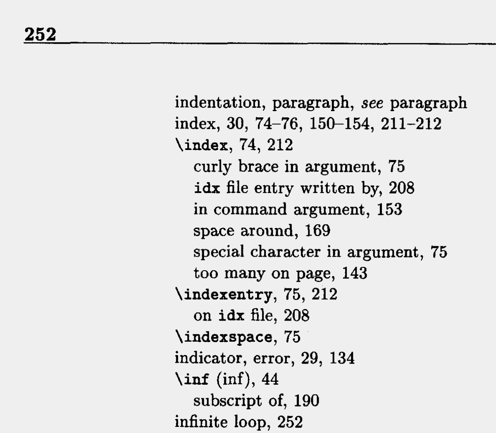
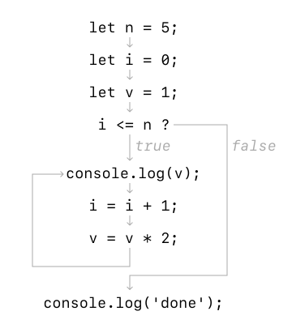
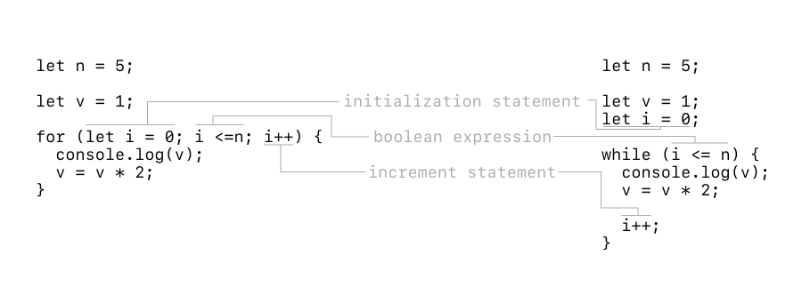

<br><br>
<figure align="center">
  
  <figcaption>An infinite loop, from <em>LaTeX. A document preparation system.</em> by Leslie Lamport. <a href="https://www.semanticscholar.org/paper/LATEX.-A-document-preparation-system.-User%27s-Guide-Lamport-Bibby/d235c1e898494912e08bb9cd437ed50a83ee335b">↗</a></figcaption>
</figure>
<br><br>


# Loops and arrays

In our last lecture, we learned about boolean logic and how powerful it can be in directing the control flow of our program. 

Today, we’ll look at how we can use conditionals and boolean logic to execute certain statements repeatedly until certain boolean conditions are met. These are also called loops. 

There are two principal types of loops in programming languages. The `while` loop, and the `for` loop. We’ll discuss both today.

## `while` loops

A while loop works by evaluating a boolean expression and running code enclosed in brackets *while* the boolean expression remains true. Here’s a simple example:

```js
let n = 5;

let i = 0;
let v = 1;

while (i <= n) {
  console.log(v);
  i = i + 1;
  v = v * 2;
}

console.log('done');
```

What do we think this program does?

<br><br>
<figure align="center">
  
  <figcaption>Visualization of control logic when calculating powers of 2.</figcaption>
</figure>
<br><br>

It calculates the powers of 2! In this case, it’ll calculate up to and including the 5th power of 2. We can also step through the program and map out what each variable’s value is at each step of execution:

| `i` | `v`  | `i<=n`  |
|-----|------|---------|
| `0` | `1`  | `true`  |
| `1` | `2`  | `true`  |
| `2` | `4`  | `true`  |
| `3` | `8`  | `true`  |
| `4` | `16` | `true`  |
| `5` | `32` | `true`  |
| `6` | `64` | `false` |

It’s important to pay attention to syntax in loops. For example, what happens if we don’t include braces?

```js
let n = 5;

let i = 0;
let v = 1;

while (i <= n)
  console.log(v);
  i = i + 1;
  v = v * 2;

console.log('done');
```

We’ll get an **infinite loop**! That means the program will continue to execute until the end of time, or until we close the page. Why is that? It’s because without the `{}`, only the first line following the conditional will be evaluated. This is also true for `if` statements. We consider this bad practice because it your code is less explicit. So don’t do this in your programs, even though it may be valid code.

## `for` loops

Another common pattern for repeatedly executing code is the `for` loop. It’s a bit more compact than a `while` loop and offers clear legibility to the reader. Every `for` loop has an equivalent `while` loop, but the logic is all contained in the first line of the `for` statement. 

A `for` loop works by:
1. Evaluating an initialization statement, `let i = 0`
2. Evaluating a boolean expression, `i <= n`
3. If true, executing its enclosed code statements. Then, executing an increment statement, `i++`
4. Repeat steps 2–3.

Here’s two snippets of code, which both calculate powers of 2:

```js
let n = 5;

let v = 1;

for (let i = 0; i <=n; i++) {
  console.log(v);
  v = v * 2;
}
```

```js
let n = 5;

let v = 1;
let i = 0;

while (i <= n) {
  console.log(v);
  v = v * 2;

  i++;
}
```

<br><br>
<figure align="center">
  
  <figcaption>For loops are just nicer while loops.</figcaption>
</figure>
<br><br>

For loops are a really frequent pattern in programming. We can use them to:

```js
let factorial = 1;
for (let i = 1; i <= n; i++) {
  factorial = factorial * i;
}
// Calculate n! (1 * 2 * 3 * … * n)

let sum = 0;
for (let i = 1; i <= n; i++) {
  sum = sum + i;
}
// Calculate sum (1 + 2 + 3 + … + n)
```

## When to use `while` and `for`

We can generally use `for` loops for the succinctness and if we already know how many times we’ll run through it (such as with arrays). However, sometimes a `while` loop can be useful — this is especially if we don’t know how long we want our code to execute for. 

For example, let’s say we’re going through a text file and reading it programmatically line by line. We don’t know how long the text file is ahead of time, so we may choose to use a `while` loop here instead of a `for` loop.

## Nesting

So far, we’ve talked about programs with only a single layer of control logic (`if` statements, loops). However, we can actually combine them via nesting to get even more nuanced control behavior. 

For example, let’s say we want to determine if the distribution of the JS random number generator is truly random by running 1000 trials and then counting up the number of heads (lesser than 0.5) and tails.

We can set up a for loop to run the number of trials. And then on each trial, toss a coin randomly. If it’s less than 0.5, we’ll increment the `heads` counter, otherwise the `tails` counter. At the end, we can divide by the total number of trials to determine the final distribution. We should hopefully see something around 50/50. This approach is also called [Monte Carlo](https://en.wikipedia.org/wiki/Monte_Carlo_method) simulation.

```js
let trials = 1000;
let heads = 0;
let tails = 0;
for (let i = 0; i < trials; i++) {
  let r = Math.random();
  if (r < 0.5) {
    tails++;
  } else {
    heads++;
  }
}

console.log(heads/trials, tails/trials);
```

Here’s another example, also involving probability. The problem is a classic problem called [Gambler’s ruin](https://en.wikipedia.org/wiki/Gambler%27s_ruin). 

A gambler starts with a predefined `stake`. They place fair bets of `$1` each turn. This means they have a 50% chance of winning, and 50% chance of losing. There are two outcomes:
- The gambler goes broke and reaches a stake of $0.
- The gambler wins by reaching a predefined `goal`. 

If we want to know what a person’s chances are of winning, we can either do a statistical analysis, or run a Monte Carlo simulation. The more trials we run, the better our data.

```js
let stake = 5;
let goal = 25;
let trials = 1000;

let wins = 0;

for (let t = 0; t < trials; t++) {
  let currentStake = stake;
  while (currentStake > 0 && currentStake < goal) {
    if (Math.random() > 0.5) {
      currentStake++;
    } else {
      currentStake--;
    }

    if (currentStake === goal) {
      wins++;
    }
  }
}

console.log(`${wins} wins out of ${trials} trials.`);
```

---

## Arrays

A core part of what makes programming so powerful are data structures. Imagine if the only way to write code was built on these primitive data types we learned. We’d be able to do a lot, but nowhere near what we’d need to write any program we want to.

An **array** is a data structure which is an indexed sequence of values of the same type.

What can array store?
- 52 cards of a deck
- All the `<div>`s in a webpage
- The pixels of an image
- Billions of internet searches

An array works by mapping an integer to a value. It is an efficient way to store and process many values of the same type. The type does not necessarily have to be a primitive, as we’ll learn later. But for now, let us compare these two sets of code:

```js
// Store and keep track of 10 numbers
let a0 = 0.0;
let a1 = 0.0;
let a2 = 0.0;
let a3 = 0.0;
let a4 = 0.0;
let a5 = 0.0;
let a6 = 0.0;
let a7 = 0.0;
let a8 = 0.0;
let a9 = 0.0;

a4 = 3.0;
a6 = 6.5;

let sum = a4 + a6; // 9.5
```

```js
// Store and keep track of 10 numbers
let a = new Array(10);
a.fill(0.0);

a[4] = 3.0;
a[6] = 6.5;

let sum = a[4] + a[6]; // 9.5
```

| Index               | 0 | 1 | 2 | 3 | 4   | 5 | 6   | 7 | 8 | 9 |
|---------------------|---|---|---|---|-----|---|-----|---|---|---|
| Initial value       | 0 | 0 | 0 | 0 | 0   | 0 | 0   | 0 | 0 | 0 |
| Value after setting | 0 | 0 | 0 | 0 | 3.0 | 0 | 6.5 | 0 | 0 | 0 |

Which do you think is easier to maintain and update in the long run? Especially if we need to keep track of hundreds of values?

**Important Concepts**
- An array’s index counting starts with `0`.
- Given an `i`, accessing `a[i]` is a very efficient operation.
- If you set `b = a`, `b` and `a` refer to the same underlying array. This does not copy the array (as with primitive types). 

Some basic operations of arrays in JS include

```js
let a = new Array(4); // Creates a new array of length 4.
a.fill(5); // Fills the array with the number 5, [5, 5, 5, 5].
a[0] // Gets the value of the 0th index of the array a, 5.

let b = [1, 1, 2, 3, 5]; // Creates a new array of length 5 with first 5 Fibonacci numbers. This is an array literal.
b.length; // Gets the length of the array b, 5.

// Prints out the contents of array b. We use i in for loops often because it stands for index.
for (let i = 0; i < b.length; i++) {
  console.log(b[i]); 
}

// Prints out the contents of array b (another version). We’ll discuss this in more detail later. We have just created an anonymous function which .forEach() calls for each value of b, passing the value as a parameter.
b.forEach((value) => {
  console.log(value);
});

b.push(8); // Adds the value 8 to the end of the array, [1, 1, 2, 3, 5, 8].
b.pop(); // Removes the last value of the array and returns it, [1, 1, 2, 3, 5].
```

If we want to **copy** an array, we have to manually copy it. This is because arrays are pass by reference, as opposed to primitives which are pass by value.

```js
let a = [5, 4, 3];
let b = a;

a[0] = 4;
console.log(b[0]); // What do you think will print?
```

```js
let a = [5, 4, 3];
let b = new Array(a.length);
for (let i = 0; i < a.length; i++) {
  b[i] = a[i];
}

a[0] = 4;
console.log(b[0]); // What do you think will print?
```

We can do a lot with arrays and for loops, epecially when it comes to more advanced array contents. For now, let’s stick to just numbers. 

- How do we calculate the sum of all the numbers of an array?
- How do we find the maximum of all the values in an array?

### Example: A deck of cards

Let’s say we want to store an entire deck of cards (52 cards total) in an array. How would we do this? Let’s start by defining three arrays:

```js
let rank = ['2', '3', '4', '5', '6', '7', '8', '9', '10', 'J', 'Q', 'K', 'A'];
let suit = ['spades', 'hearts', 'diamonds', 'clubs'];
let deck = new Array(52);

deck = new Array(rank.length * suit.length); // Same thing, less brittle.
```

We can then use a nested for loop to put all the cards into our deck:

```js
for (let i = 0; i < rank.length; i++) {
  for (let j = 0; j < suit.length; j++) {
    deck[i + j*13] = rank[i] + suit[j]; // First value will be '2spades'
  }
}

for (let i = 0; i < deck.length; i++) {
  console.log(deck[i]);
}
```

What do you think happens if we switch the order of the for loops? 

```js
for (let j = 0; j < suit.length; j++) {
  for (let i = 0; i < rank.length; i++) {
    deck[13*i + j] = rank[i] + rank[j];
  }
}
```

Now we have our deck of cards, what if we want to print out a random sequence of cards?

```js
let n = 5;
for (let i = 0; i < n; i++) {
  let randIdx = Math.floor(Math.random() * 52); // Why can’t we use round here? Math.random() generates a random number between 0 and 1.
  console.log(deck[randIdx]);
}
```

## 2D Arrays

Did you know that you can have an array of arrays? Why would anyone want this? Consider these representations of data:
- Grades for students in a class
- Pixels of an image
- Transactions of a bank

A 2D array is pretty straight forward and is built on top of existing array syntax. Let’s take a look:

```js
let img = [
  [255, 255, 255],
  [0, 255, 0],
  [255, 255, 255]
];

img[0]; // Gets the value at index 0 (row 0), [255, 255, 255];
img[0][0]; // Gets the value at index 0, of the value of index 0, 255.

img[1].length; // Length of the row at index 1, 3. Different rows can have different lengths.
```

Let’s pretend we have a grayscale image (values frange from 0 to 255) and we want to write a simple filter that reduces its brightness by a certain amount. How would we do this?

```js
let reductionAmount = 5;

for (let i = 0; i < img.length; i++) {
  for (let j = 0; j < img[i].length; j++) {
    img[i][j] = img[i][j] - reductionAmount;
    if (img[i][j] < 0) {
      img[i][j] = 0; // Why do we do this?
    }
  }
}
```

## Objects

[Objects](https://developer.mozilla.org/en-US/docs/Web/JavaScript/Reference/Global_Objects/Object) are another common data structure in JavaScript. This is a key area where JavaScript differs from other programming languages. 

Objects are used to store various keyed collections and more complex values. 

With objects, data is stored in key-value pairs. You must know the key, which is a string, in order to access the value. Arrays are accessed using a numerical index.

Why do we call this data type an object? Well, it is meant to represent an entity. In fact, we’ll spend an entire lecture later talking about Object Oriented Programming. 

For now, here’s an example syntax:

```js
  let apple = {
    color: 'green',
    weight: 25,
    'isRotten': false
  }; // Defines a variable apple with object literal syntax. It contains three keys and values. Note the usage of commas to separate these key values.

  apple['color']; // Access an object with key 'color', 'green'.
  apple.color; // Similar as above, but less flexible. You can use either.

  apple.isRotten = true; // Updates the value of apple.isRotten.
```

Like arrays, objects are also pass by reference. If you want to create a copy of an object, you’ll have to write more specialized logic. We can’t just iterate over an object like we would an array. More on this later. 

Objects can store primitives, arrays, and even other objects. Let’s take a look at this example below:

```js
  let apiResponse = {
    ok: true,
    statusCode: '200',
    response: {
      title: 'JS Lecture',
      content: 'Don’t you already know everything about JS?',
      comments: [
        'Too short!',
        'Yes obviously',
        'I think I might have missed something'
      ]
    }
  }
```

This is an example of using JS object notation to return an API response. In fact, this method of representing object literals in JavaScript is so popular that it is called JSON for JavaScript Object Notation.

How would we access the first element of the API response?

```js
apiResponse['response']['comments'][0];

// These two are equivalent

let response = apiResponse['response'];
let comments = response['comments'];
comments[0] 
```