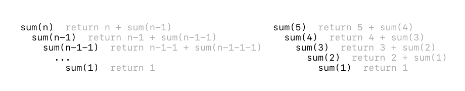
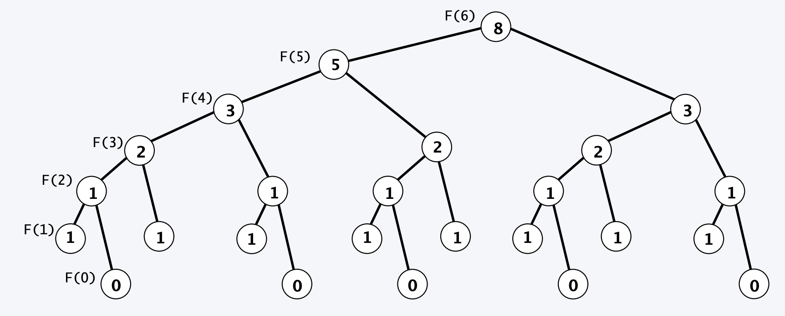
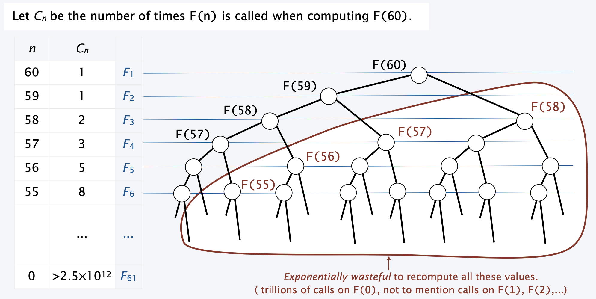
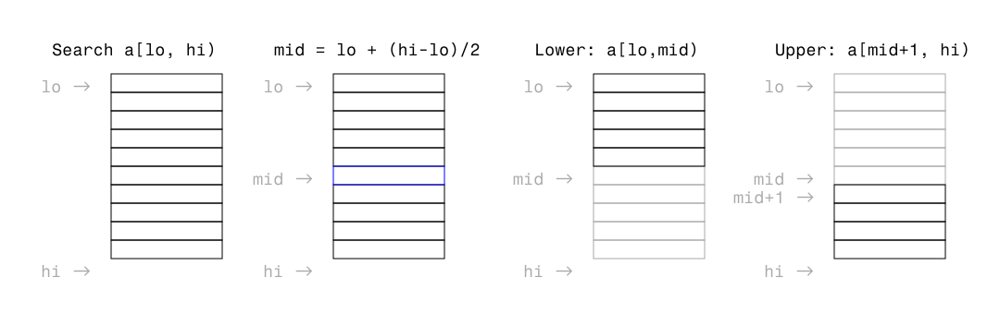
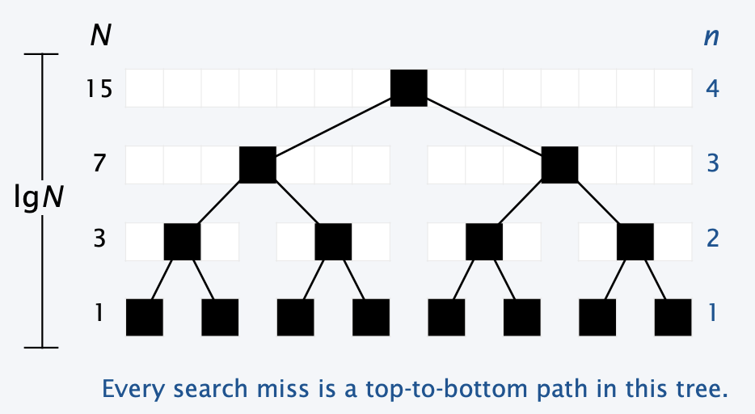
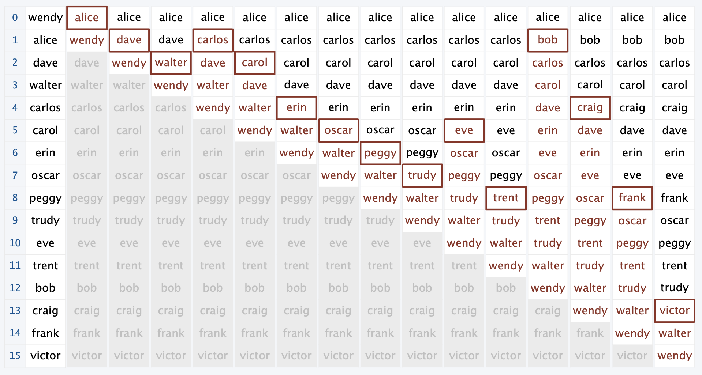

<br><br>
<figure align="center">
  
  <figcaption>1904 Droste cocoa tin, designed by Jan Musset, the Droste effect is a form of visual recursion. <a href="https://en.wikipedia.org/wiki/Recursion">↗</a></figcaption>
</figure>
<br><br>


# Recursion, Searching, and Sorting

## Recursion

Recursion is a programming paradigm in which a function calls itself again and again until a condition is met. We use recursion because many paradigms in computing are self-referential and nested:
- File systems with folders containing folders
- Fractal design (like the Sierpenski Triangle)
- Divide and conquer algorithms

A recursive function generally has a base case, where the function call stack finishes, and a reduction step, which breaks the current problem up into smaller pieces.

### Simple example: Sum of N numbers

Let’s start off with a simple example. Calculate the sum of all the whole numbers from `1` to `n` using recursion:

```js
let sum = (n) => {
  if (n === 1) {
    return n;
  }
  return n + sum(n-1);
}

sum(5); // What will this give us?
```

Why does this work? Each time `sum()` is called, it is called with smaller and smaller values until we get to a base case. Once a function call finishes, it will return back up to the function that called it. 

<br><br>
<figure align="center">
  
  <figcaption>Visualization of the above recursive function.</figcaption>
</figure>
<br><br>

## Some common gotchas

```js
let sum = (n) => {
  return n + sum(n-1);
}
```

What’s wrong with the above example? We’re missing a base case. This means that our program will run forever since it doesn’t know when to stop. 

```js
let sum = (n) => {
  if (n === 1) {
    return n;
  }
  return n + sum(n+1);
}
```

The above example, we don’t have what’s called a **convergence guarantee**. That is, there is no guarantee that we’ll ever arrive at our base case due to a typo in our recursive call. This will lead to an infinite loop as well.

### Another example: Fibonacci

If you remember from the first assignment, we used for loops to calculate fibonacci numbers. How would we do this recursively?

```js
Fn = Fn-1 + Fn-2
```

```js
let fib = (n) => {
  if (n === 0) {
    return 0;
  }
  if (n === 1) {
    return 1;
  }

  return fib(n-1) + fib(n-2);
}

fib(5);
```

Is recursion always the solution? Not necessarily. Let’s take a look at the call stack of our above fibonacci code:

<br><br>
<figure align="center">
  
  <figcaption>Call stack of our fibonacci function. Graphics are from a <a href="https://www.cs.princeton.edu/courses/archive/fall22/cos126/static/lectures/CS.6.Recursion.pdf">COS126 lecture</a>.</figcaption>
</figure>
<br><br>

<br><br>
<figure align="center">
  
  <figcaption>The problem with how we’re using recursion is there is a lot of repeated computation. Graphics are from a <a href="https://www.cs.princeton.edu/courses/archive/fall22/cos126/static/lectures/CS.6.Recursion.pdf">COS126 lecture</a>.</figcaption>
</figure>
<br><br>

This can be solved with something called dynamic computing, which allows you to store pre-computed values in an array. Here’s how we could use that:

```js
let memory = new Array(100).fill(0);

let fib = (n) => {
  if (n === 0) {
    return 0;
  }
  if (n === 1) {
    return 1;
  }
  if (memory[n] === 0) {
    memory[n] = fib(n-1) + fib(n-2);
  }

  return memory[n];
}

fib(5);
console.log(memory);
```

## Searching

Let’s talk about some algorithms — the first concerns with an operation you’ll probably do quite often: search. Say you have an array of usernames for your software, and you want to search to see if someone has input a valid username:

```js
let usernames = [
  'carol',
  'alice',
  'bob',
  'carlos',
  'craig',
  'dave',
  'eric',
  'hal',
  'peggy',
  'trent',
  'anthony',
  'alex',
  'wendy',
  'megan',
  'hope'
];
```

We would use sequential search to determine if there was a match:

```js
let search = (username) => {
  for (let i = 0 ; i < usernames.length; i++) {
    if (usernames[i] === username) {
      return i;
    }
  }
  return -1;
}

search('eric');
```

This works well enough for small sets of data, but imagine if you are a company with thousands or millions of usernames. What is the worst case running time of this?

### Runtime

<br><br>
<figure align="center">
  
  <figcaption>We often use Big-O to determine how efficient our code is.</figcaption>
</figure>
<br><br>

As we delve into algorithms, we start to care about a metric called run time. This is an abstract measurement of how long it takes to run your heuristic in the best case, the average case, and the worst case. The most common way of measuring efficiency is a type of notation called [Big-O](https://www.freecodecamp.org/news/all-you-need-to-know-about-big-o-notation-to-crack-your-next-coding-interview-9d575e7eec4/). This notation takes into account:

- `O` is the order of the function, or its growth rate
- `N` is the length of the data, usually in an array form.

In our above example of sequential search, if we had to go through all the elements of an array to find if an element is in it or not, it would take `O(N)` amount of time to do it. We call this a linear relationship — the amount of time it takes to run our algorithm grows at the same scale as the size of our data set. Most of the time, single for loops will have a time complexity of `O(N)`.

What is the time complexity of this code?
```js
let image = [
  [0, 1, 1],
  [0, 1, 0],
  [1, 1, 0]
];

for (let i = 0; i < image.length; i++) {
  for (let j = 0; j < image[i].length; j++) {
    image[i][j]++;
  }
}
```

The time complexity is `O(N^2)`, or `O(N*N)` because we have a nested for loop. This is called exponential growth. 

### A more efficient way of searching: Binary Search

So sequential search works well enough for small sets of data. But can we do any better? 

We can! We can use something called binary search. Binary search works by way of:
- Having a sorted array
- Keeping track of a middle key
- If the middle key matches our query, return that index
- If the middle key is larger than our query, search the lower half
- If the middle key is smaller than our query, search the upper half

```js
let usernamesSorted = [
  'alex', 
  'alice',
  'anthony', 
  'bob', 
  'carlos', 
  'carol', 
  'craig', 
  'dave', 
  'eric', 
  'hal', 
  'hope', 
  'megan', 
  'peggy', 
  'trent', 
  'wendy'
];
```

<br><br>
<figure align="center">
  
  <figcaption>Visualization of binary search.</figcaption>
</figure>
<br><br>

How would we write this heuristic out in code?

```js
let searchArray = (key, a) => {
  return search(key, a, 0, a.length);
}

let search = (key, a, lo, hi) => {
  if (hi <= lo) {
    return -1;
  }
  let mid = Math.floor(lo + (hi-lo)/2);
  if (a[mid] > key) {
    return search(key, a, lo, mid);
  } else if (a[mid] < key) {
    return search(key, a, mid+1, hi);
  } else {
    return mid;
  }
}
```

What is the time complexity of binary search? 

<br><br>
<figure align="center">
  
  <figcaption>Visualization of binary search in a tree format.</figcaption>
</figure>
<br><br>

In the worse case (when we can’t find anything and we have to go all the way to the base condition), binary search will take at most `O(logN)` to run. This means it is much more efficient than sequential search. 


## Sorting

The one thing to note about binary search is that the array MUST be sorted in order for it to work correctly. This takes us to our next set of algorithms: sorting. This is a classical question in computer science: what is the most efficient way to sort an array?

> [Bogosort](https://en.wikipedia.org/wiki/Bogosort), aka stupid sort, will randomly shuffle the array until it is sorted. 

### Insertion Sort

<br><br>
<figure align="center">
  
  <figcaption>Visualization of insertion sort in action.</figcaption>
</figure>
<br><br>

Insertion sort as an algorithm:
- Move through an array
- Each item you encounter "bubbles up" through the larger ones above it
- Everything before the current item is in order
- Everything after the current item has not been touched

<br><br>
<figure align="center">
  
  <figcaption>Trace of insertion sort. Graphics are from a <a href="https://www.cs.princeton.edu/courses/archive/fall22/cos126/static/lectures/CS.11.SearchSort.pdf">COS126 lecture</a>.</figcaption>
</figure>
<br><br>

```js
  let sort = (a) => {
    // Outer for loop keeps going up through our array
    for (let i = 0; i < a.length; i++) {
      // Inner for loop starts at the current index and "bubbles" the element up if its previous element is bigger than it
      for (let j = i; j > 0; j--) {
        if (a[j-1] > a[j]) {
          // We use a temp variable to exchange our values
          let tmp = a[j-1];
          a[j-1] = a[j];
          a[j] = tmp;
        } else {
          // The break keyword jumps out of our inner for loop, since we don’t want to keep going once the element is in place.
          break;
        }
      }
    }
  }

  sort(usernames);
```

What is the run time of this? Well, we notice the two for loops which in the worst case will go through our array two times (last element needs to go all the way up front). So the run time is `O(N^2)`. 

If we need to run sort then search, the worser run time is what we care about. Is there a faster way to sort so that our run time matches that of binary search?

### Mergesort

<br><br>
<figure align="center">
  
  <figcaption>Visualization of merge sort in action.</figcaption>
</figure>
<br><br>

The heuristic for merge sort is very similar to binary search — a subdivide and conquer:
- Divide array into two halves
- Sort each half
- Merge the two halves into a sorted whole

```js
  // We use an additional array as a scratch pad. This doubles the amount of memory our program uses.
  let aux;

  // All the magic happens here. To merge, we keep track of two pointers: i starts at the first half, j starts at the second half.
  let merge = (a, lo, mid, hi) => {
    let i = lo;
    let j = mid;
    let N = hi-lo;

    // Iterate through all our elements we are trying to merge.
    for (let k = 0; k < N; k++) {
      if (i === mid) {
        // If i is at the middle, we need to finish merging by adding the remaining j elements
        aux[k] = a[j];
        j++;
      } else if (j === hi) {
        // If j is at the end, we need to finish merging by adding the remaining i elements
        aux[k] = a[i];
        i++;
      } else if (a[i] < a[j]) {
        // If i is lesser than j, add i
        aux[k] = a[i];
        i++;
      } else {
        // Otherwise, add j
        aux[k] = a[j];
        j++;
      }
    }

    // Copy back over
    for (let k = 0; k < N; k++) {
      a[lo+k] = aux[k];
    }
  }

  let sort = (a, lo, hi) => {
    let N = hi - lo;
    if (N <= 1) {
      return;
    }
    let mid = Math.floor(lo + N/2);
    // Recursive part
    sort(a, lo, mid);
    sort(a, mid, hi);
    merge(a, lo, mid, hi);
  }

  let sortArray = (a) => {
    aux = new Array(a.length);
    sort(a, 0, a.length);
  }
```

What’s the running time of merge sort? Since we are doing a similar divide and conquer, we can determine its running time is `O(NlogN)`. This means that if we need to first sort, then search an array, our worst case run time is `O(NlogN)` (this is the worse of the two). 

Want to learn more about this? Take a [data structures and algorithms](https://www.coursera.org/learn/algorithms-part1) class.