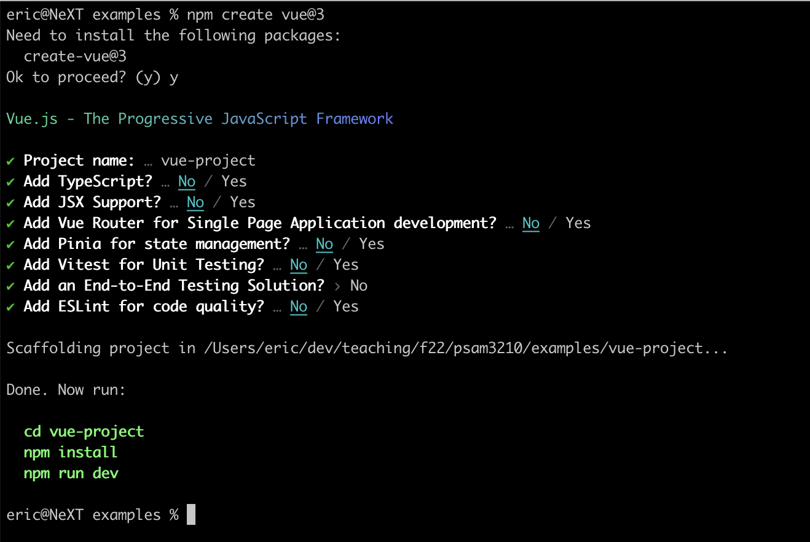

<br><br>
<figure align="center">
  
  <figcaption><a href="https://vuejs.org/guide/essentials/component-basics.html">Destructuring a web page into components.</a></figcaption>
</figure>
<br><br>

## What is Vue?

Vue is a JavaScript framework for building user interfaces. It builds on top of standard HTML, CSS, and JavaScript and provides a declarative and component-based programming model that helps you efficiently develop user interfaces, be they simple or complex.

Vue is a [single page application](https://en.wikipedia.org/wiki/Single-page_application) framework, much like React, Svelte, or Angular. SPAs work by loading all the application code and logic into the browser when you load the page. Then, based on your interaction, it will conditionally render or change the contents presented on the page. Entire websites are built using these frameworks, most famously Facebook.

## Installing Vue and Vite

Prior to class, install [Node](https://nodejs.org/en/). If you’ve been using running your assignment tests locally, you’ve already done this.

<br><br>
<figure align="center">
  
  <figcaption>Installing Vue</figcaption>
</figure>
<br><br>

Now, create a Vue app in your code directory, and follow the prompts. For now, select no for everything except for the first prompt.

```sh
npm create vue@3
```

After you run through the prompts, follow the commands you were given:

```sh
cd vue-project
npm install
npm run dev
```

This will first change your directory to the directory with your Vue application in it. At this point, you’ve actually installed both Vue, as well as Vite. [Vite](https://vitejs.dev/) is both a local development server, as well as a module bundler for deployment. 

In essence, we’ll use Vite as the platform on which we build Vue webapps.

## Deploy to GitHub pages

We’ll also have to configure our code to run in GitHub Pages. Create a new file at `.github/workflows/node.js.yml` and add the following code:

```yml
# This workflow will do a clean installation of node dependencies, cache/restore them, build the source code and run tests across different versions of node
# For more information see: https://docs.github.com/en/actions/automating-builds-and-tests/building-and-testing-nodejs

name: Node.js CI

on:
  push:
    branches: [ "main" ]
  pull_request:
    branches: [ "main" ]

jobs:
  build:

    runs-on: ubuntu-latest

    strategy:
      matrix:
        node-version: [16.x]
        # See supported Node.js release schedule at https://nodejs.org/en/about/releases/

    steps:
    - uses: actions/checkout@v3
    - name: Use Node.js ${{ matrix.node-version }}
      uses: actions/setup-node@v3
      with:
        node-version: ${{ matrix.node-version }}
        cache: 'npm'
    - run: npm ci
    - run: npm run build --if-present
    - name: Deploy
      uses: peaceiris/actions-gh-pages@v3
      with:
        github_token: ${{ secrets.GITHUB_TOKEN }}
        publish_dir: ./dist
```

In addition, edit your `vite.config.js` file to include a line which sets the base URL of your site on GitHub pages (it should be your repository name if you are not using custom domain names). For example, my `vite.config.js` for a repositroy name `vite-template` looks like this:

```js
import { fileURLToPath, URL } from 'node:url'

import { defineConfig } from 'vite'
import vue from '@vitejs/plugin-vue'

// https://vitejs.dev/config/
export default defineConfig({
  plugins: [vue()],
  base: 'vite-template',
  resolve: {
    alias: {
      '@': fileURLToPath(new URL('./src', import.meta.url))
    }
  }
})
```

This will let GitHub pages build your app and host it at the right location. 

> Thank you to this [guide](https://blog.codedbyjordan.com/deploying-a-vite-app-with-github-actions) and the official [Vite documentation](https://vitejs.dev/guide/static-deploy.html) for material to put this section together.

## Or… just clone this template

Lucky for you, you can also just copy this [template repository](https://github.com/f22-psam3210/vite-template) which already has some of this behavior built in to your own repository.

1. Once you’ve created a repository off of the template, enable GitHub pages. If you forgot how to do so, reference our topic on [Git](/topics/git/). 
2. Pull your code to your computer, run `npm install` to install Vite and Vue into your system.
3. Edit `vite.config.js` as mentioned previously to mirror your repository name.
4. Run `npm run dev` to get a local version of your code running.

After this, any commits and pushes to GitHub will automatically deploy your website correctly.

## Anatomy of a Vue project

Our project contains the following:

```
.github/            # GitHub Actions workflow
.vscode/            # VSCode settings
dist/               # Built Vite files
public/             # Non-compiled static assets not used in Vue (like favicon)
src/                # Source files
.gitignore          # Git ignored stuff
README.md           # README
index.html          # index.html that pulls in built JS and static assets
package-lock.json   # Locks packages to specific versions
package.json        # Package manager and metadata file
vite.config.js      # Vite configuration file
```

We’ll take a closer look at the `src/` folder. It contains the following files:

```
assets/             # CSS and other assets for Vue components
components/         # Vue components
App.vue             # Main App component (pulls together other components)
main.js             # Orchestrates (sets up) the Vue app
```

There’s a lot going on here! So it’s really important to keep our file names coherent and organization clean. 

## Components

The bread and butter of any Vue or SPA based web app is components. A [component](https://vuejs.org/guide/essentials/component-basics.html) allows us to divide our interface elements into independent and reusable parts. Just like we want to modularize our JavaScripts, HTML, and CSS, SPAs let us modularize our interfaces. An app is created by organizing a collection of nested components. 

A Vue component is **self contained**. It will contain the HTML template required to show it, the JavaScript required to make it interactive, and the CSS required to render it correctly. This makes components very portable!

Vue makes use of the existing custom component syntax that exists within HTML, but implements its own behavior. The goal is to represent an interface in a clean and self-contained way. For example, we could show a todo list as such:

```html
<list>
  <list-item text="Item 1" checked="false" />
  <list-item text="Item 2" checked="false" />
  <list-item text="Item 3" checked="true" />
</list>
```

### `.vue` files

Vue components most commonly live in `component-name.vue` files. These files are ingested by Vue and Vite and rendered into constituent HTML/CSS/JS formats. Here’s a very basic example of a `greeting.vue`:

```html
<template>
  <p class="greeting">{{ greeting }}</p>
</template>

<script>
   export default {
     data() {
       return {
         greeting: 'Hello World!'
       }
     }
   }
</script>

<style>
   .greeting {
     color: red;
     font-weight: bold;
   }
</style>
```

## Component lifecycle

<br><br>
<figure align="center">
  
  <figcaption>A lovely diagram of the lifecycle of a component</figcaption>
</figure>
<br><br>

## More resources

- [Vue Tutorial](https://vuejs.org/tutorial/#step-1)
- [Vue Documentation](https://vuejs.org/guide/essentials/application.html)
- [Vite](https://vitejs.dev/)