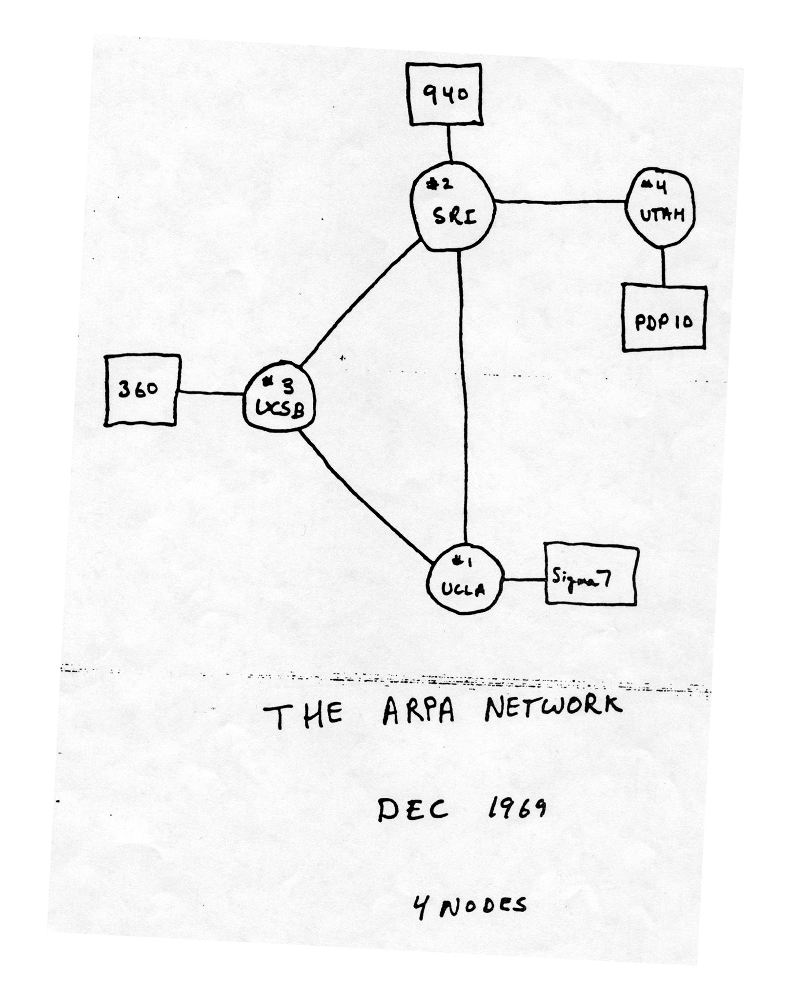
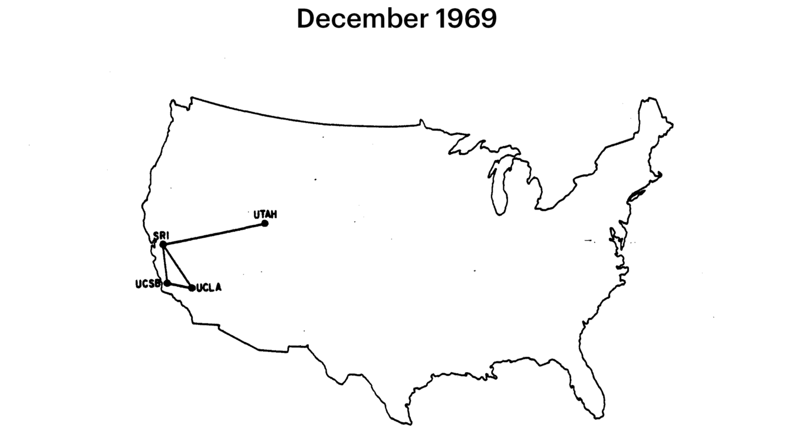
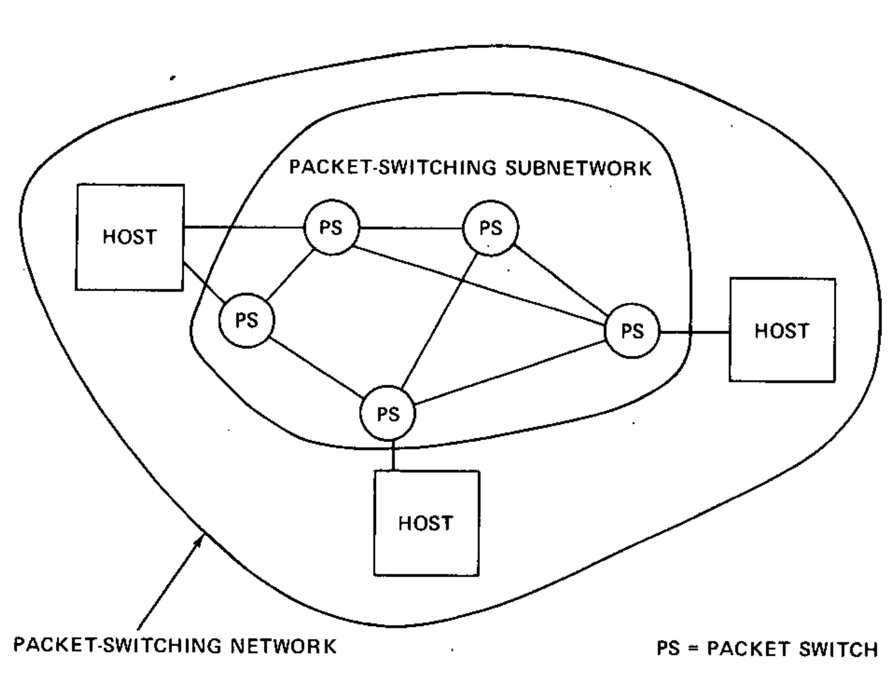
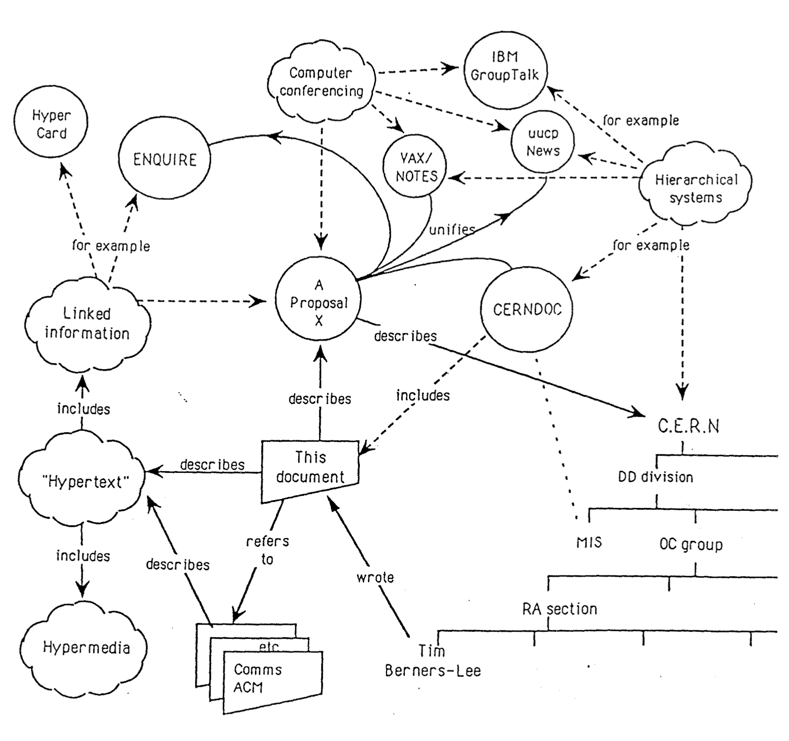
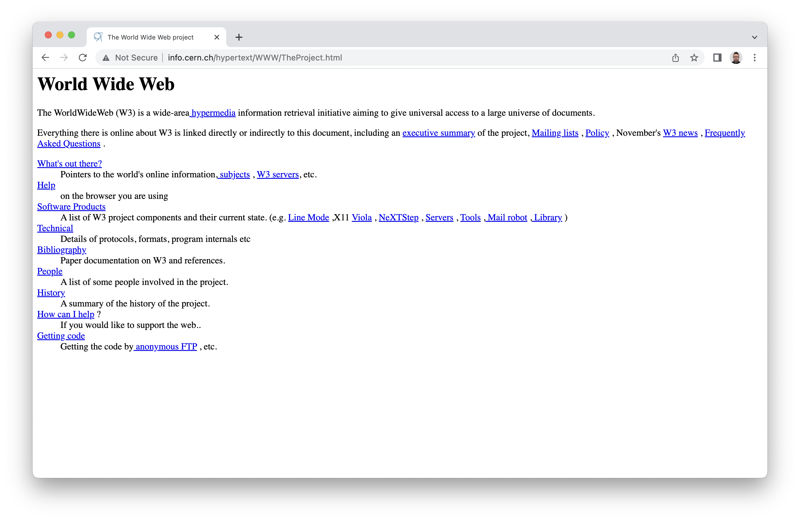
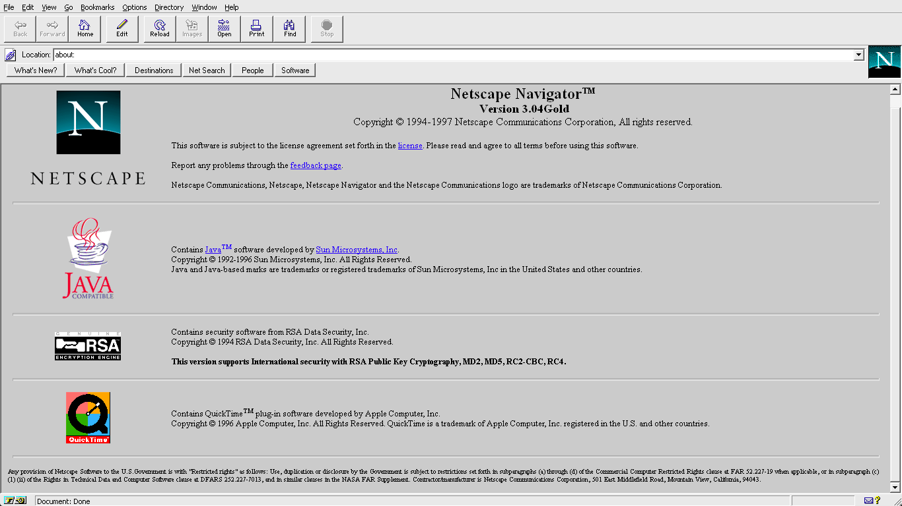
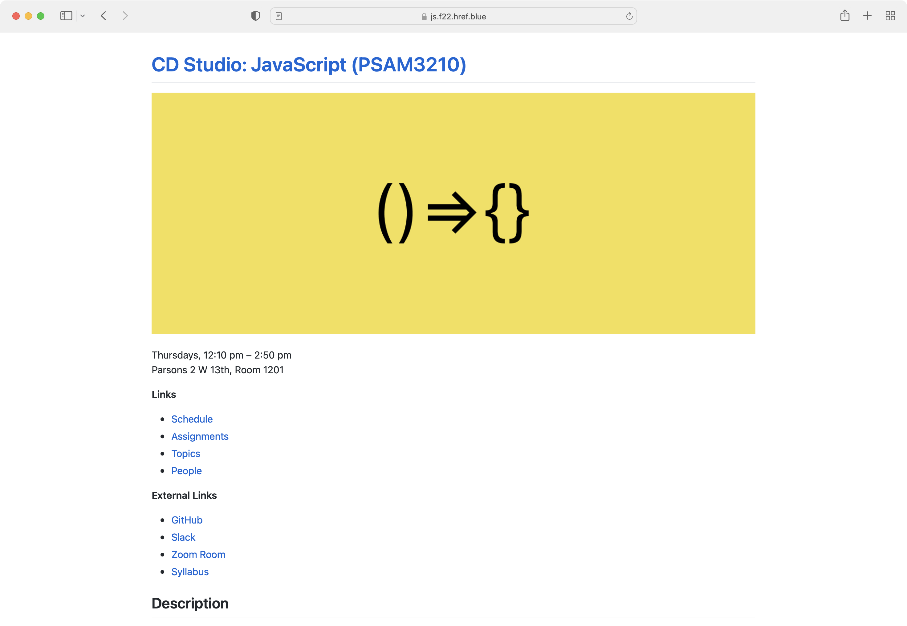
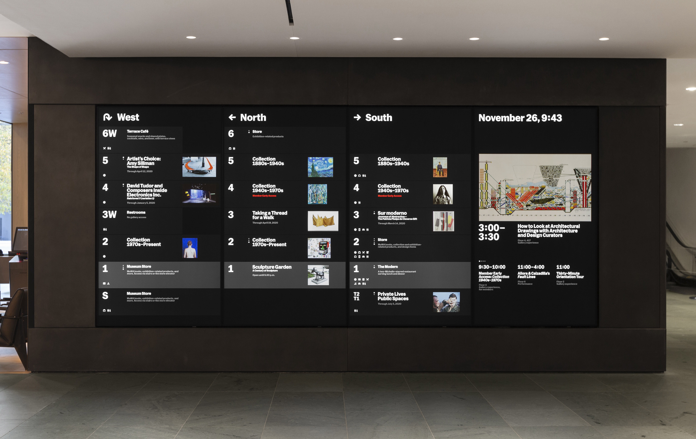

  
<figure align="center">
  
  <figcaption>Time to add JavaScript into the mix!</figcaption>
</figure>
  

# What is JavaScript, anyways?
Before we can get into this, let’s understand the shape of the web and how we got to where we are today.

## Let’s start with *the internet*

The internet was invented in 1969.

  
<figure align="center">
  
  <figcaption><a href="https://en.wikipedia.org/wiki/Harvard_Computers#/media/File:Astronomer_Edward_Charles_Pickering%27s_Harvard_computers.jpg">The “Harvard Computers” in the late 1800s.</a></figcaption>
</figure>
  

Before this time, the term *computer* usually referred to a person, not a machine—someone who would *compute* (solve) math problems.

It is worth noting these [were often women](https://www.nytimes.com/2019/02/13/magazine/women-coding-computer-programming.html), and they were underpaid compared to men in their field—and many would go on to operate the early mechanical/electronic computers. We’re going to have to talk about a lot of men, here—but know that women have been present from the start.

### The first computers

  
<figure align="center">
  
  <figcaption>A diagram from Ada Lovelace’s first computer program.</figcaption>
</figure>
  

Before the 1900s and the rise of the internet as we know it, [Charles Babbage](https://en.wikipedia.org/wiki/Charles_Babbage) invented the first mechanical computer, called the [Difference Engine](https://en.wikipedia.org/wiki/Difference_engine), in the 1820s. It’s purpose was to tabulate polynomial functions. While it was never completed, we often consider this to be the first example of a computer. Within this story, we also meet the first computer programmer, Ada Lovelace.

[Ada Lovelace](https://en.wikipedia.org/wiki/Ada_Lovelace) wrote a piece of software, or heuristic, for Babbage’s Difference Engine which calculated Bernoulli Numbers. Because it was the first published algorithm tailored specifically for a computer, Lovelace is often cited as a seminal figure in computer science history.

  
<figure align="center">
  
  <figcaption>ENIAC, the first programmable, electronic, general-purpose digital computer completed in 1945.</figcaption>
</figure>
  

By the 1960s, computers were room-sized, institutional electronic machines—used by governments (the military), businesses, and universities. They were used to solve complex math problems and sort data, but were still very slow and didn’t communicate with one another.

  
<figure align="center">
  
  <figcaption>The original network, the telephone infrastructure, was heavily centralized via its switchboards and central hubs and therefore susceptible to catastrophic attack.</figcaption>
</figure>
  

### Back to the internet…

A catalyst in the formation of the internet was the Cold War. The threat of nuclear conflict spurred the US Defense Department to consider decentralized and distributed <nobr>networks—to</nobr> disseminate orders and information in the event of an attack (and ultimately, for retaliation).

> It was necessary to have a strategic system that could withstand a first attack and then be able to return the favor in kind. The problem was that we didn’t have a survivable communications system, and so Soviet missiles aimed at US missiles would take out the entire telephone-communication system [...] that was highly centralized. Well, then, let’s not make it centralized. Let’s spread it out so that we can have other paths to get around the damage.
>
> — [Paul Baran](https://www.vanityfair.com/news/2008/07/internet200807)

  
<figure align="center">
  
  <figcaption><a href="https://www.scientificamerican.com/gallery/early-sketch-of-arpanets-first-four-nodes/">The original network sketch for ARPANET.</a></figcaption>
</figure>
  

By 1969, computer nodes connected the Stanford Research Institute, UCLA, UCSB and the University of Utah—developed by the Defense Department’s *Advanced Research Project Agency* (ARPA).

  
<figure align="center">
  
  <figcaption>ARPANET grows in the 1970s</figcaption>
</figure>
  

Over the following decade, [ARPANET](https://www.britannica.com/topic/ARPANET) would grow to include other cities in the US. It had its first expansion outside the States in 1973, with connections to the UK and Norway. Slowly, similar commercial and academic networks were developing alongside, each with their own communication protocols.

  
<figure align="center">
  
  <figcaption><a href="https://web.eecs.umich.edu/~prabal/teaching/eecs582-w13/readings/CK74.pdf">TCP/IP, one of the standards the internet is built on, which routes bundles of data called “packets”.</a></figcaption>
</figure>
  

In 1974, Robert Kahn and Vinton Cerf (two ARPA scientists) developed the *Transmission Control Protocol* and the *Internet Protocol* (TCP/IP). By the 80s, it became the standard network communication format—and still underpins the internet we all use today.

### Standards

Standards will come up time and again throughout this class. They are what allow for the internet, and the web to exist. TCP/IP was a standard, which different manufacturers came together to implement so that computers could communicate with each other. Much of the internet and web is *also* built on standards, some of which you may know, such as HTML, CSS, and JavaScript…

## What about *the web*?

The web as we know it came 20 years later in 1989.

  
<figure align="center">
  
  <figcaption>Tim Berners-Lee</figcaption>
</figure>
  

Tim Berners-Lee, a British academic and scientist, invented the *World Wide Web* (WWW) with his team while working at [CERN in 1989](https://home.cern/science/computing/birth-web/short-history-web). It was developed on top of TCP/IP as a standard way to connect documents, living on different computers in different places, via *hypertext* links.

  
<figure align="center">
  
  <figcaption>The cover of the original proposal, visualizing the idea of “hypertext.”</figcaption>
</figure>
  

Their proposal had four components:

* A text file format to represent the documents: the *HyperText Markup Language* (HTML)
* The rules for exchanging these documents: the *HyperText Transfer Protocol* (HTTP)
* A program to display (and edit) these documents: the first *web browser* (called WorldWideWeb)
* Software that gives access to the documents: the *server* (an early version of Apache/httpd)

  
<figure align="center">
  
  <figcaption><a href="http://info.cern.ch/hypertext/WWW/TheProject.html">A recreation of the very first website.</a></figcaption>
</figure>
  

By 1991, the [first web page](http://info.cern.ch/hypertext/WWW/TheProject.html) was up and running and began to take off.

  
<figure align="center">
  
  <figcaption>Netscape, created by Marc Andreessen, was one of the very first web browsers. Unlike the original WWW, Netscape and its predecessor Mosaic supported images.</figcaption>
</figure>
  

The 1990s then saw more-affordable home computers bring internet access to many more people—escaping the government (military), business, and university settings it had been siloed in before. Early web browsers like [Mosaic and Netscape](https://en.wikipedia.org/wiki/History_of_the_web_browser) (1993) helped evolve what was possible online—adding color, images, and interactivity.

And the web [exploded from there](https://www.versionmuseum.com/).

> The dream behind the Web is of a common information space in which we communicate by sharing information. Its universality is essential: the fact that a hypertext link can point to anything, be it personal, local or global, be it draft or highly polished.
>
> — [Tim Berners-Lee](https://www.scienceandmediamuseum.org.uk/objects-and-stories/short-history-internet)

## So what are *web pages*?

Glad you asked. 

  
<figure align="center">
  
  <figcaption>Our course site is a webpage!</figcaption>
</figure>
  

Obviously, *this* is a web page. Think about how many other web pages you have visited in the past day. Dozens, even hundreds?

  
<figure align="center">
  
  <figcaption>Maybe a more unconventional webpage, the <a href="https://www.moma.org/screens/on_view/south?contain=true">screens at MoMA</a>.</figcaption>
</figure>
  

Ultimately, a web page is a just text file on a computer. It is written in a special format, the aforementioned HTML, which structures the content of the document and also links it to other resources—other web pages, images, computers, really almost anything. Think of the web as type with instructions.

These all started as simple, hand-typed documents. Then as the power of computers grew, and the languages of the web evolved alongside—web pages expanded almost inconceivably in complexity and capabilities. *Cascading Style Sheets* (CSS) gave them marvelous abilities to be customized and designed. *JavaScript* (JS) gave them remarkable, newfound interactivity and function. Websites (collections of web pages) today are built on top of an incredible *stack* of technology—networks, servers, databases, libraries, browsers, devices.

## An ever-present visual medium

If you’re looking at a glowing, 16:9 rectangle somewhere (and it isn’t just playing video), nowadays it is very likely a web page—built with the exact same HTML, CSS, and JS—web technologies—that are behind this page, and every other.

In its openness, connectedness, and ubiquity, the web has come to dominate over other forms of technology. Its advantages in compatibility, cost, scale, and inertia are continuing to snowball, and the advance of these web technologies shows no sign of slowing down. It is the water that we are swimming in, both as humans and as designers.

And in that latter role, we’ll need to learn how to swim. Our path into *design* then is to understand how these things are made and how they function. Their technological construction both empowers and constrains our work. You can’t separate the design from this foundation; the medium is inextricable from the end product.

> Most people make the mistake of thinking design is what it looks like. People think it’s this veneer—that the designers are handed this box and told, “Make it look good!” That’s not what we think design is. It’s not just what it looks like and feels like. Design is how it works.
>
> — [Steve Jobs](https://www.nytimes.com/2003/11/30/magazine/the-guts-of-a-new-machine.html)

### These days, apps are often web pages too

  
<figure align="center">
  
  <figcaption>These are all web pages.</figcaption>
</figure>
  

All these desktop “apps” are built in [Electron](https://www.electronjs.org)—and so are really just web pages inside a slim, platform-native wrapper. (Essentially, a single-website browser.)

The core application only has to be written once, instead of rewritten for each platform. And why design it all again? (Designers are expensive!) Why hire Windows and Mac devs when you can just hire web devs? …then why hire iOS or Android devs, either? (Developers are even more expensive!) So many companies take approach, for cross-platform development.

Many mobile “apps” are all built with [React Native](https://reactnative.dev), following a similar paradigm. The app is really just a web view, and every screen within is a web page.

## It’s increasingly just JS, behind the scenes

  
<figure align="center">
  
  <figcaption>Ah, JavaScript.</figcaption>
</figure>
  

JavaScript began as a client-side (on your computer), front-end language running in the browser. But now with engines like [V8](https://v8.dev) and environments like [Node](https://nodejs.org/en/), JS has moved to server-side (on the remote computer) functionality previously dominated by scripting languages like [ASP](https://www.google.com/url?sa=t&rct=j&q=&esrc=s&source=web&cd=&cad=rja&uact=8&ved=2ahUKEwjEtfa8nc31AhUomeAKHd_ABUQQFnoECE8QAQ&url=https%3A%2F%2Fdotnet.microsoft.com%2Fen-us%2Flearn%2Faspnet%2Fwhat-is-aspnet&usg=AOvVaw1D_8ap9ArdBqxmTX1ce1xL), [Perl](https://www.perl.org), [PHP](https://www.php.net), [Ruby](https://www.ruby-lang.org/en/).

This means that JavaScript doesn’t just run *in* a webpage you’re looking at—it often now actually *builds* the page itself. It might even send you the *packets*. More and more, JS isn’t a *part* of the stack so much as it really *is* the stack.

This “javascript everywhere” movement means that the tendrils of the web can encompass many non-web-page uses. Maybe it is in an app, maybe a headless data API, maybe a [hardware integration](https://www.theverge.com/2022/8/18/23206110/james-webb-space-telescope-javascript-jwst-instrument-control), maybe it is even something entirely *offline*—but it is still web technologies, most of the way down.

---

## So what is JavaScript?

At the end of the day, JavaScript is a programming language for the web. It provides the tools necessary to make a website interactive. Much like HTML and CSS do their share to make a site understandable and look good, JS helps it respond to your input. But the thing about the web is that it is constantly changing.

Therefore, while you will be learning JavaScript throughout this course, we will take a Computer Science first approach. What does this mean? It means that as the shape of the web changes, evolves, and grows, and perhaps someday when we have all moved beyond JavaScript, you will still have the tools necessary to program and build interactive software. In your careers, the software, languages, and platforms might be different, and to some extent, are ever-changing—but the design/technological ideas and considerations are analogous and universal. 

*A hat-tip to [Tuan Pham](https://tuanpham.info) and [Michael Fehrenbach](https://michaelfehrenbach.com/) for source material for this lecture.*